# LTI - Sistema de Seguimiento de Talento

> Documento de producto y arquitectura del ATS (Applicant Tracking System) **LTI**, orientado a agencias de reclutamiento y headhunters bajo modelo de licencia on-premise.

## Índice

1. [Descripción general del producto](#1-descripción-general-del-producto)
2. [PRD y casos de uso](#2-prd-y-casos-de-uso)
3. [Arquitectura del sistema](#3-arquitectura-del-sistema)
4. [Modelo de datos](#4-modelo-de-datos)
5. [Especificación de la API](#5-especificación-de-la-api)
5. Especificación de la API *(pendiente)*
6. Historias de usuario *(pendiente)*
7. Tickets de trabajo *(pendiente)*
8. Pull requests *(pendiente)*

---

## 1. Descripción general del producto

### 1.1 Descripción General

**LTI** es un *Applicant Tracking System* (ATS) full-stack —React en el frontend, Express + TypeScript + Prisma en el backend— diseñado específicamente para **agencias de reclutamiento y headhunters** que gestionan procesos de selección para múltiples empresas cliente.

A diferencia de los ATS enterprise tradicionales (Greenhouse, Workable, Lever, BambooHR) que se entregan como SaaS multi-tenant con suscripciones recurrentes elevadas, LTI se distribuye bajo **licencia perpetua on-premise**: la agencia despliega el sistema en su propia infraestructura, paga una sola vez y mantiene el control total de los datos de candidatos —un requisito crítico bajo GDPR y para clientes corporativos sensibles a la confidencialidad.

El núcleo funcional del producto es un **tablero Kanban de candidatos**, donde cada columna representa una posición abierta y las tarjetas son candidatos que el reclutador desplaza entre fases del proceso de entrevista. La columna inicial siempre es `No Asignado`, lo que permite tener un *pool* de candidatos disponibles que aún no han sido vinculados a una vacante concreta.

### 1.2 Objetivo

#### Descripción

Proveer a agencias de reclutamiento un ATS auto-hospedado, sencillo y funcional que cubra el **80% de las necesidades operativas** del día a día sin la complejidad ni el coste de las soluciones enterprise:

- Alta y mantenimiento de candidatos con CV (PDF), formación y experiencia laboral.
- Gestión de posiciones abiertas por empresa cliente, con flujos de entrevista personalizables.
- Tablero Kanban para mover candidatos entre fases del proceso.
- Registro de entrevistas con evaluaciones (score, notas, resultado).
- Sourcing multi-canal: portal público de autocandidatura, alta manual por el reclutador, e integración con LinkedIn y job boards (Indeed, InfoJobs).

#### Valor añadido

| Eje | Aporte concreto |
|-----|-----------------|
| **Soberanía del dato** | El despliegue on-premise elimina el riesgo de fuga a terceros y simplifica el cumplimiento GDPR para clientes regulados (banca, salud, sector público). |
| **TCO predecible** | Una licencia perpetua sustituye al pago recurrente por seat. Para una agencia con 10–30 reclutadores, el ahorro a 3 años frente a Greenhouse/Workable suele superar el 60–70%. |
| **Sin vendor lock-in** | Stack abierto (PostgreSQL + Prisma + Express + React). El cliente puede modificar, extender o migrar sin depender del proveedor. |
| **Personalización por proceso** | El modelo `InterviewFlow` + `InterviewStep` permite definir flujos distintos por tipología de vacante (técnica, comercial, ejecutiva). |
| **Simplicidad operativa** | UI orientada a una sola tarea principal (mover candidatos en el Kanban), sin la sobrecarga de módulos enterprise (compliance avanzado, analytics complejos, surveys). |

#### Ventajas competitivas

1. **Precio único vs. SaaS recurrente** — diferenciador económico fuerte para agencias pequeñas/medianas con márgenes ajustados.
2. **On-premise auditable** — clave para concursos públicos y clientes en sectores regulados que requieren residencia de datos en su propia infraestructura.
3. **Stack moderno y abierto** — atrae a agencias con perfil técnico que valoran poder personalizar el producto.
4. **Curva de aprendizaje plana** — flujo de trabajo Kanban familiar (similar a Trello/Jira), sin formación extensa.

### 1.3 Investigación y Análisis de Mercado

#### Panorama del sector

El mercado global de ATS supera los 2.300 M USD (2024) con crecimiento sostenido del 7–8% anual. Está dominado por suites SaaS enterprise (Greenhouse, Workable, Lever, BambooHR, SmartRecruiters) que han consolidado un modelo de **suscripción por seat con tiers** —típicamente 6.000–20.000 USD/año para agencias medianas— más cargos por integraciones premium.

#### Segmento desatendido

Las **agencias de reclutamiento de tamaño pequeño y medio (5–50 reclutadores)** sufren tres dolores recurrentes:

- **Coste recurrente desproporcionado** frente a su volumen real de procesos.
- **Funcionalidad sobredimensionada**: pagan por módulos (compliance enterprise, encuestas de candidato, analytics avanzados) que rara vez usan.
- **Pérdida de control del dato**: clientes finales (sobre todo del sector público o regulados) cada vez exigen más que los datos de candidatos no salgan de la jurisdicción del contratante.

LTI se posiciona explícitamente en este hueco: *un ATS funcional, on-premise, con licencia perpetua y enfoque en el flujo Kanban de candidatos*.

#### Valor añadido frente a la competencia

| Capacidad | Greenhouse / Workable / Lever | LTI |
|-----------|-------------------------------|-----|
| Modelo comercial | SaaS suscripción (€€€/seat/mes) | Licencia perpetua on-premise |
| Soberanía del dato | Multi-tenant cloud del proveedor | Infraestructura del cliente |
| Tiempo de onboarding | 2–4 semanas con consultor | Despliegue Docker + carga inicial (días) |
| Personalización del flujo | Por configuración, dependiente del tier | Modelo abierto (`InterviewFlow`) modificable en código |
| Coste a 3 años (10 seats) | 60–120k € | Licencia + soporte (típicamente <30k €) |

#### Ventajas competitivas (síntesis)

- **Económica**: TCO drásticamente menor para volúmenes pequeños/medios.
- **Regulatoria**: cumplimiento GDPR y residencia de datos sin esfuerzo adicional.
- **Técnica**: stack abierto, base de datos accesible, integración con sistemas internos del cliente sin pasar por una API de terceros.
- **Operativa**: producto "lo justo" — diseñado para hacer bien lo esencial, sin distraer al reclutador con módulos secundarios.

### 1.4 Funcionalidades Principales, alternativas, customer journey

#### Funcionalidades principales

1. **Gestión de candidatos**: alta, edición, adjuntar CV en PDF, registrar formación académica (con periodos) y experiencia laboral (empresa, posición, fechas, descripción).
2. **Gestión de posiciones**: cada empresa cliente tiene posiciones abiertas con título, descripción, requisitos, salario, ubicación, modalidad, fecha límite y un `InterviewFlow` asociado.
3. **Tablero Kanban**: vista por posición donde las columnas son las fases del flujo de entrevista (`InterviewStep`) y las tarjetas son las aplicaciones de candidatos. Existe siempre una columna inicial `No Asignado`.
4. **Tarjeta de candidato**: muestra nombre + apellidos, titulación más importante (la última), última experiencia laboral (posición + empresa) con fecha de inicio y fin.
5. **Entrevistas**: registro de cada entrevista realizada con `score`, `result`, `notes`, `interviewDate` y entrevistador asignado.
6. **Sourcing multi-canal**:
   - Portal público de autocandidatura.
   - Alta manual por el reclutador.
   - Importación desde LinkedIn y job boards (Indeed, InfoJobs).
7. **API REST** (estado por endpoint):
   - `POST /candidates` → alta de candidato con formación, experiencia y CV. *(implementado)*
   - `GET /candidates/:id` → detalle del candidato. *(implementado)*
   - `POST /upload` → subida de CV en PDF. *(implementado)*
   - `GET /positions/:id/candidates` → lista candidatos de una posición con nombre, fase actual y score medio de entrevistas. *(pendiente — clave para el Kanban)*
   - `PUT /candidates/:id/stage` → mueve un candidato entre fases del Kanban. *(pendiente — clave para el Kanban)*

#### Alternativas en el mercado

| Solución | Modelo | Posicionamiento | Limitación principal frente a LTI |
|----------|--------|-----------------|-----------------------------------|
| **Greenhouse** | SaaS, alto coste | Enterprise, mid-market grande | Coste, complejidad, multi-tenant cloud |
| **Workable** | SaaS, coste medio | PYME y mid-market | Suscripción recurrente, sin on-premise |
| **Lever** | SaaS, alto coste | Enterprise CRM-céntrico | Sobredimensionado para agencias pequeñas |
| **BambooHR (ATS)** | SaaS, módulo de HRIS | PYMEs con HR generalista | Atado a la suite HRIS |
| **Recruitee / Teamtailor** | SaaS, coste bajo-medio | PYME / agencias pequeñas | Sin opción on-premise, dato en cloud |
| **OpenCATS (open-source)** | On-premise gratuito | Agencias técnicas DIY | UX y stack desactualizados, sin soporte oficial |

LTI se ubica en el **hueco entre OpenCATS (gratuito pero técnicamente obsoleto) y Recruitee/Workable (modernos pero SaaS recurrente)**: stack moderno + on-premise + licencia perpetua con soporte.

#### Customer Journey

**Reclutador (usuario principal)**

1. La agencia firma con un cliente nuevo (empresa contratante) → da de alta la `Company` en LTI.
2. Define el flujo de entrevista de esa empresa (`InterviewFlow` con sus `InterviewStep`).
3. Crea las posiciones abiertas (`Position`) que la empresa quiere cubrir.
4. **Sourcing**: recibe candidatos por tres vías —autocandidatura del portal público, alta manual, importación desde LinkedIn/job boards— que entran en la columna `No Asignado` del Kanban.
5. Revisa los candidatos del pool, filtra por adecuación y los **arrastra a la primera fase** de la posición correspondiente (`PUT /candidates/:id/stage`).
6. A medida que se realizan entrevistas, registra el resultado, score y notas.
7. Mueve al candidato entre fases hasta `Contratado` o `Descartado`.

**Candidato (usuario secundario, vía portal público)**

1. Llega al portal público de la empresa cliente (subdominio o URL servida por el portal de LTI).
2. Consulta las posiciones abiertas visibles (`isVisible = true`).
3. Aplica a una posición → rellena formulario, sube CV en PDF, completa formación y experiencia.
4. Recibe confirmación. Su candidatura entra en la primera fase del flujo de la posición.
5. (Futuro) Recibe notificaciones por email cuando avanza de fase.

### 1.5 Lean Canvas

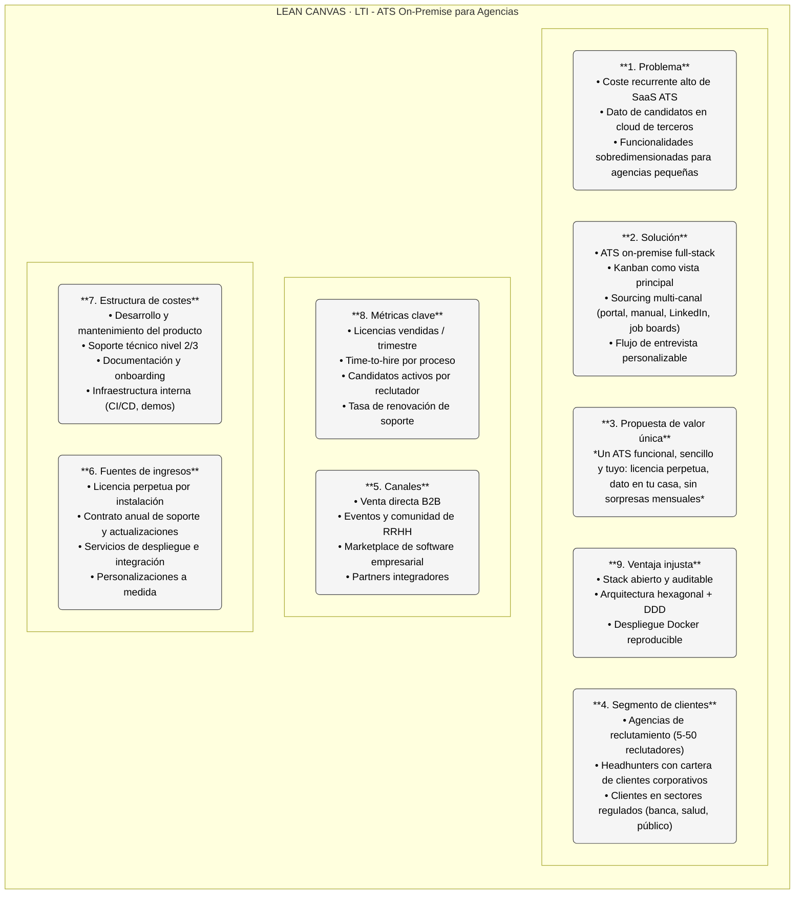
```mermaid
flowchart TB
    subgraph LC["LEAN CANVAS · LTI - ATS On-Premise para Agencias"]
        direction TB

        subgraph Top[" "]
            direction LR
            P["**1. Problema**<br/>• Coste recurrente alto de SaaS ATS<br/>• Dato de candidatos en cloud de terceros<br/>• Funcionalidades sobredimensionadas para agencias pequeñas"]
            S["**2. Solución**<br/>• ATS on-premise full-stack<br/>• Kanban como vista principal<br/>• Sourcing multi-canal (portal, manual, LinkedIn, job boards)<br/>• Flujo de entrevista personalizable"]
            UVP["**3. Propuesta de valor única**<br/>*Un ATS funcional, sencillo y tuyo: licencia perpetua, dato en tu casa, sin sorpresas mensuales*"]
            UA["**9. Ventaja injusta**<br/>• Stack abierto y auditable<br/>• Arquitectura hexagonal + DDD<br/>• Despliegue Docker reproducible"]
            CS["**4. Segmento de clientes**<br/>• Agencias de reclutamiento (5-50 reclutadores)<br/>• Headhunters con cartera de clientes corporativos<br/>• Clientes en sectores regulados (banca, salud, público)"]
        end

        subgraph Mid[" "]
            direction LR
            KM["**8. Métricas clave**<br/>• Licencias vendidas / trimestre<br/>• Time-to-hire por proceso<br/>• Candidatos activos por reclutador<br/>• Tasa de renovación de soporte"]
            CH["**5. Canales**<br/>• Venta directa B2B<br/>• Eventos y comunidad de RRHH<br/>• Marketplace de software empresarial<br/>• Partners integradores"]
        end

        subgraph Bot[" "]
            direction LR
            CSt["**7. Estructura de costes**<br/>• Desarrollo y mantenimiento del producto<br/>• Soporte técnico nivel 2/3<br/>• Documentación y onboarding<br/>• Infraestructura interna (CI/CD, demos)"]
            RS["**6. Fuentes de ingresos**<br/>• Licencia perpetua por instalación<br/>• Contrato anual de soporte y actualizaciones<br/>• Servicios de despliegue e integración<br/>• Personalizaciones a medida"]
        end
    end

    classDef block fill:#f5f5f5,stroke:#444,color:#000,rx:6,ry:6;
    class P,S,UVP,UA,CS,KM,CH,CSt,RS block;
```

### 1.6 Estado actual del código

El repositorio ya contiene una base ejecutable del backend (Node.js + Express + Prisma + PostgreSQL en Docker) y del frontend (React). Esta sección refleja **lo que existe hoy** frente a lo que el documento de producto describe — útil para priorizar el roadmap.

#### Backend

**Estructura de carpetas (real):**

```
backend/
├── prisma/
│   ├── schema.prisma         # 12 entidades modeladas
│   ├── seed.ts               # carga datos de prueba (LTI, 3 candidatos, 2 posiciones, ...)
│   └── migrations/           # historial de migraciones
└── src/
    ├── index.ts              # bootstrap Express, CORS, prisma middleware
    ├── domain/models/        # Candidate, Education, WorkExperience, Resume,
    │                         # Company, Employee, InterviewType, InterviewFlow,
    │                         # InterviewStep, Position, Application, Interview
    ├── application/
    │   ├── services/         # candidateService, fileUploadService
    │   └── validator.ts      # validaciones de entrada
    ├── presentation/
    │   └── controllers/      # candidateController
    └── routes/               # candidateRoutes
```

**Endpoints HTTP existentes** (montados en `index.ts`):

| Método | Ruta | Estado | Descripción |
|--------|------|--------|-------------|
| GET | `/` | ✅ | Healthcheck `"Hola LTI!"` |
| POST | `/candidates` | ✅ | Crea candidato con educación, experiencia y CV anidados |
| GET | `/candidates/:id` | ✅ | Recupera candidato por ID |
| POST | `/upload` | ✅ | Sube fichero (CV en PDF) |
| GET | `/positions/:id/candidates` | ❌ | **Pendiente** — clave para el Kanban |
| PUT | `/candidates/:id/stage` | ❌ | **Pendiente** — clave para el Kanban |
| * | `/positions`, `/companies`, `/applications`, `/interviews` | ❌ | Sin rutas todavía; los modelos existen en Prisma |

**Modelo de datos** (Prisma): completo y consistente con el dominio descrito — `Candidate` con `Education[]`, `WorkExperience[]`, `Resume[]`, `Application[]`; `Position` con `InterviewFlow` y `Application[]`; `Application` con `currentInterviewStep` apuntando al step actual del Kanban; `Interview` con `score`, `result`, `notes`. La query `GET /positions/:id/candidates` se puede resolver con un `findMany` sobre `Application` filtrado por `positionId` + `include` de candidato y `_avg` sobre `interviews.score`.

**Infraestructura local:** PostgreSQL 16 en Docker (`docker-compose.yml`), credenciales en `.env`, base `LTIdb`, puerto `5432`. Backend escucha en `:3010`, frontend (CRA) en `:3000` con CORS abierto a ese origen.

#### Frontend

Aplicación CRA en `frontend/`. Confirmar el alcance actual de pantallas excede el objetivo de este documento; según `PROJECT.MD`, **falta el menú de alta de candidatos y la vista de tablero Kanban** — son los dos entregables principales del frontend.

#### Brechas funcionales frente al producto descrito

| Área | Brecha | Prioridad sugerida |
|------|--------|-------------------|
| API Kanban | Endpoints `GET /positions/:id/candidates` y `PUT /candidates/:id/stage` | **Alta** — habilitan el caso de uso central |
| UI Kanban | Vista de tablero con drag & drop entre columnas (fases) | **Alta** |
| UI Candidatos | Formulario de alta y edición de candidato | **Alta** |
| Sourcing | Portal público de autocandidatura | Media |
| Sourcing | Integración LinkedIn / Indeed / InfoJobs | Media-Baja |
| Seguridad | Autenticación y autorización (no existe middleware de auth) | **Alta** antes de producción |
| Multi-tenant | Aislamiento por agencia/empresa cliente — el modelo asume una sola agencia | Media (depende de si una instalación on-premise = una agencia) |
| Notificaciones | Email a candidato al avanzar de fase | Baja |
| Tests | Existe `tests/` pero cobertura por validar | Media |

#### Notas arquitectónicas observadas

- El código sigue **separación por capas DDD** (`domain` / `application` / `presentation`) pero los modelos de dominio implementan estilo **Active Record** (`Candidate.save()`, `Candidate.findOne()` acceden a Prisma directamente) en lugar de usar puertos/adaptadores. Es **DDD por capas, no hexagonal estricta**. Si se quiere alinear con el principio DIP del README de producto, una refactor a repositorios (interfaz en `domain`, implementación Prisma en `infrastructure`) es el siguiente paso natural.
- No existe carpeta `infrastructure/` todavía — la persistencia está acoplada a los modelos de dominio.
- El controller `candidateController` exporta dos versiones de `addCandidate` y la ruta usa la del *service* directamente, saltándose el controller. Inconsistencia menor a limpiar.

---

## 2. PRD y casos de uso

### 2.1 Visión general del PRD

Documento de requisitos del producto centrado en los **5 casos de uso primarios** que cubre la API REST del backend (3 implementados + 2 pendientes — los dos pendientes son los habilitadores del tablero Kanban descrito en el punto 1). Cada caso de uso se detalla con: actores, precondiciones, flujos principal y alternativos, postcondiciones, reglas de negocio, criterios de aceptación en Gherkin, requisitos no funcionales, métricas de éxito, edge cases, dependencias técnicas y un diagrama UML de secuencia en PlantUML. Adicionalmente se incluye un diagrama global de casos de uso (vista panorámica).

**Notación:**

- Estado: ✅ implementado · ❌ pendiente
- Prioridad MoSCoW: **M** (Must) · **S** (Should) · **C** (Could) · **W** (Won't this iteration)

**Inventario de casos de uso:**

| ID | Nombre | Endpoint | Estado | Prioridad |
|----|--------|----------|--------|-----------|
| CU-01 | Crear candidato | `POST /candidates` | ✅ | M |
| CU-02 | Consultar candidato por ID | `GET /candidates/:id` | ✅ | M |
| CU-03 | Subir CV | `POST /upload` | ✅ | M |
| CU-04 | Listar candidatos por posición (Kanban) | `GET /positions/:id/candidates` | ❌ | M |
| CU-05 | Actualizar fase del candidato | `PUT /candidates/:id/stage` | ❌ | M |

### 2.2 Diagrama global de casos de uso

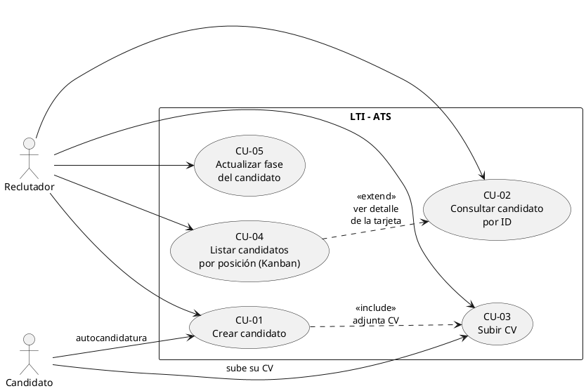
```plantuml
@startuml LTI - Casos de uso
left to right direction
skinparam packageStyle rectangle

actor "Reclutador" as R
actor "Candidato" as C

rectangle "LTI - ATS" {
  usecase "CU-01\nCrear candidato"                                    as UC1
  usecase "CU-02\nConsultar candidato\npor ID"                        as UC2
  usecase "CU-03\nSubir CV"                                           as UC3
  usecase "CU-04\nListar candidatos\npor posición (Kanban)"           as UC4
  usecase "CU-05\nActualizar fase\ndel candidato"                     as UC5
}

R --> UC1
R --> UC2
R --> UC3
R --> UC4
R --> UC5
C --> UC1 : autocandidatura
C --> UC3 : sube su CV

UC1 ..> UC3 : <<include>>\nadjunta CV
UC4 ..> UC2 : <<extend>>\nver detalle\nde la tarjeta
@enduml
```

---

### 2.3 CU-01 · Crear candidato

| Campo | Valor |
|-------|-------|
| **ID / Nombre** | CU-01 · Crear candidato |
| **Endpoint** | `POST /candidates` |
| **Estado** | ✅ Implementado |
| **Prioridad** | Must |
| **Actor principal** | Reclutador (alta manual) · Candidato (autocandidatura desde portal) |

**Descripción.** Da de alta un candidato con sus datos personales, formación académica, experiencia laboral y CV adjunto. La operación crea el agregado completo: o se persisten todas las entidades anidadas o falla.

**Precondiciones.**

- Backend accesible en `:3010` y BD migrada.
- Si el body incluye `cv`, el fichero se subió previamente vía `CU-03` y se conoce su `filePath`.

**Postcondiciones (éxito).**

- Existe un registro en `Candidate` con email único.
- Se crearon `Education[]`, `WorkExperience[]` y `Resume[]` asociados al candidato.
- Respuesta `201` con el candidato persistido (incluye `id`).

**Flujo principal.**

1. Cliente envía `POST /candidates` con JSON `{ firstName, lastName, email, phone, address, educations[], workExperiences[], cv }`.
2. `candidateRoutes` invoca `addCandidate(req.body)` del service.
3. `validateCandidateData` valida formato (email, teléfono, fechas, longitudes).
4. Se instancia `Candidate` y se llama `candidate.save()` → `prisma.candidate.create`.
5. Por cada item de `educations`, `workExperiences` y `cv`, se crea la entidad asociada con el `candidateId` recién obtenido.
6. Respuesta `201` con candidato y entidades hijas.

**Flujos alternativos / excepciones.**

- **A1 — Email duplicado:** Prisma lanza `P2002`; el service relanza `Error("The email already exists in the database")` → router responde `400`.
- **A2 — Datos inválidos:** validator lanza `Error` con mensaje específico → `400`.
- **A3 — Fallo BD:** error genérico → `500`.

**Reglas de negocio.**

- `email` es identificador único de candidato.
- `educations`, `workExperiences` y `cv` son opcionales; si se envían, sus elementos deben validar uno a uno.
- No hay deduplicación adicional (mismo nombre+apellidos no es bloqueante).

**Criterios de aceptación.**

```gherkin
Feature: Alta de candidato

  Scenario: Alta exitosa con datos completos
    Given un cuerpo JSON válido con email "ana@example.com" y 1 educación
    When envío POST /candidates
    Then la respuesta es 201
    And el cuerpo contiene un id numérico
    And existe un registro en Candidate con ese email

  Scenario: Email duplicado
    Given que ya existe un Candidate con email "ana@example.com"
    When envío POST /candidates con el mismo email
    Then la respuesta es 400
    And el mensaje contiene "email already exists"

  Scenario: Email con formato inválido
    Given un cuerpo JSON con email "no-es-email"
    When envío POST /candidates
    Then la respuesta es 400
```

**Requisitos no funcionales.**

- **Rendimiento:** P95 < 500 ms con 1 educación + 1 experiencia + 1 CV.
- **Validación:** server-side obligatoria; nunca confiar en validación de cliente.
- **Seguridad:** Prisma parametriza queries (mitiga SQL injection); sanitizar al renderizar para prevenir XSS.
- **Auditoría (futuro):** registrar `createdAt` y origen (manual / portal / LinkedIn / job board).

**Métricas de éxito.**

- Tasa de creación correcta > 99%.
- Latencia media < 300 ms.
- Errores 5xx < 0.1%.

**Edge cases.**

- Cuerpo vacío → 400.
- `Education.endDate` anterior a `startDate` → debe rechazarse en validator.
- CV con `filePath` inexistente en disco → falla en creación de `Resume`.
- Caracteres unicode (acentos, eñes, ideogramas) en nombres → soportar UTF-8 end-to-end.

**Dependencias técnicas.**

- Modelos Prisma: `Candidate`, `Education`, `WorkExperience`, `Resume`.
- Capas: `routes/candidateRoutes` → `application/services/candidateService` → `domain/models/Candidate.save()`.
- Servicios externos: ninguno.

**Diagrama UML de secuencia.**

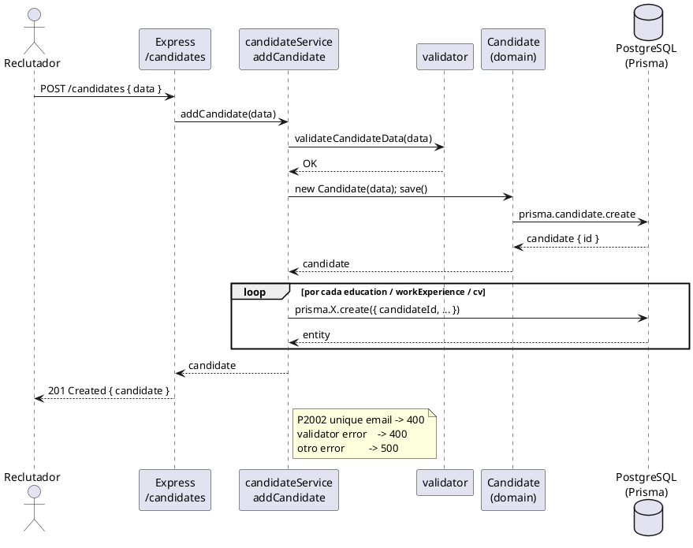
```plantuml
@startuml CU-01 Crear candidato
actor Reclutador as U
participant "Express\n/candidates" as R
participant "candidateService\naddCandidate" as S
participant "validator" as V
participant "Candidate\n(domain)" as M
database "PostgreSQL\n(Prisma)" as DB

U -> R : POST /candidates { data }
R -> S : addCandidate(data)
S -> V : validateCandidateData(data)
V --> S : OK
S -> M : new Candidate(data); save()
M -> DB : prisma.candidate.create
DB --> M : candidate { id }
M --> S : candidate

loop por cada education / workExperience / cv
  S -> DB : prisma.X.create({ candidateId, ... })
  DB --> S : entity
end

S --> R : candidate
R --> U : 201 Created { candidate }

note right of S
  P2002 unique email -> 400
  validator error    -> 400
  otro error         -> 500
end note
@enduml
```

---

### 2.4 CU-02 · Consultar candidato por ID

| Campo | Valor |
|-------|-------|
| **ID / Nombre** | CU-02 · Consultar candidato por ID |
| **Endpoint** | `GET /candidates/:id` |
| **Estado** | ✅ Implementado |
| **Prioridad** | Must |
| **Actor principal** | Reclutador |

**Descripción.** Recupera la ficha de un candidato a partir de su identificador numérico.

**Precondiciones.**

- Backend disponible.
- El cliente conoce un `id` de candidato.

**Postcondiciones.**

- Si existe → `200` con la ficha. Si no existe → `404`. Si `id` no es número → `400`.

**Flujo principal.**

1. Cliente envía `GET /candidates/:id`.
2. `candidateController.getCandidateById` lee `req.params.id` y aplica `parseInt`.
3. Si `isNaN(id)` → `400 { error: "Invalid ID format" }`.
4. Llama `findCandidateById(id)` → `Candidate.findOne(id)` → `prisma.candidate.findUnique`.
5. Si nulo → `404 { error: "Candidate not found" }`. Si existe → `200` con candidato.

**Flujos alternativos.**

- **A1 — id no numérico:** `400`.
- **A2 — candidato no encontrado:** `404`.
- **A3 — error interno:** `500 { error: "Internal Server Error" }`.

**Reglas de negocio.**

- Acceso directo por id; no hay autorización por reclutador propietario en la implementación actual (gap conocido — ver punto 1.6).

**Criterios de aceptación.**

```gherkin
Feature: Consulta de candidato

  Scenario: Candidato existente
    Given un Candidate con id 7
    When envío GET /candidates/7
    Then la respuesta es 200
    And el cuerpo contiene firstName, lastName, email

  Scenario: Candidato inexistente
    Given que no existe Candidate con id 9999
    When envío GET /candidates/9999
    Then la respuesta es 404

  Scenario: ID no numérico
    When envío GET /candidates/abc
    Then la respuesta es 400
```

**Requisitos no funcionales.**

- **Rendimiento:** P95 < 100 ms (lookup por PK).
- **Seguridad (gap):** debería requerir autenticación; no aplica en V1.

**Métricas de éxito.**

- Latencia P95 < 100 ms.
- Disponibilidad > 99.9%.

**Edge cases.**

- `id` ≤ 0 → 404 (no existe registro con ese id).
- `id` excede rango de int → 400 ó 404.

**Dependencias técnicas.**

- Modelo Prisma: `Candidate` (sin relaciones cargadas hoy; pendiente decidir si se anexan educations/workExperiences/applications).
- Capas: `routes/candidateRoutes` → `presentation/controllers/candidateController.getCandidateById` → `application/services/candidateService.findCandidateById` → `domain/models/Candidate.findOne`.

**Diagrama UML de secuencia.**

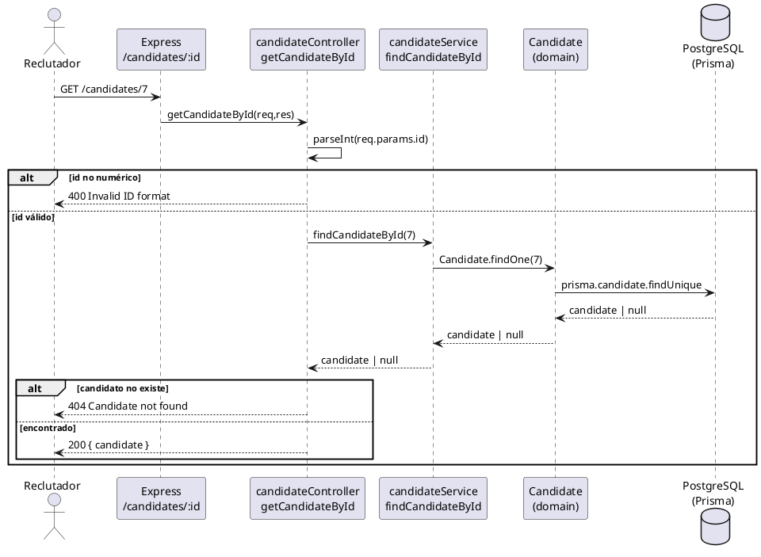
```plantuml
@startuml CU-02 Consultar candidato
actor Reclutador as U
participant "Express\n/candidates/:id" as R
participant "candidateController\ngetCandidateById" as C
participant "candidateService\nfindCandidateById" as S
participant "Candidate\n(domain)" as M
database "PostgreSQL\n(Prisma)" as DB

U -> R : GET /candidates/7
R -> C : getCandidateById(req,res)
C -> C : parseInt(req.params.id)

alt id no numérico
  C --> U : 400 Invalid ID format
else id válido
  C -> S : findCandidateById(7)
  S -> M : Candidate.findOne(7)
  M -> DB : prisma.candidate.findUnique
  DB --> M : candidate | null
  M --> S : candidate | null
  S --> C : candidate | null
  alt candidato no existe
    C --> U : 404 Candidate not found
  else encontrado
    C --> U : 200 { candidate }
  end
end
@enduml
```

---

### 2.5 CU-03 · Subir CV

| Campo | Valor |
|-------|-------|
| **ID / Nombre** | CU-03 · Subir CV (PDF) |
| **Endpoint** | `POST /upload` |
| **Estado** | ✅ Implementado |
| **Prioridad** | Must |
| **Actor principal** | Reclutador · Candidato |

**Descripción.** Sube un fichero PDF al backend; devuelve la ruta interna que se asociará a la entidad `Resume` cuando se cree el candidato (CU-01).

**Precondiciones.**

- Backend disponible.
- Existe directorio de uploads escribible.

**Postcondiciones.**

- Fichero almacenado en filesystem del backend.
- Respuesta con metadatos del fichero (incluye `filePath`).

**Flujo principal.**

1. Cliente envía `POST /upload` con `multipart/form-data` (campo `file`).
2. Middleware (`multer` u equivalente) recibe el fichero.
3. `fileUploadService` valida tipo (PDF) y tamaño.
4. Persiste el fichero en disco con nombre único.
5. Responde con `{ filePath, fileType, originalName, ... }` para que CU-01 lo referencie en el campo `cv`.

**Flujos alternativos.**

- **A1 — Tipo no permitido:** `400 Invalid file type`.
- **A2 — Tamaño excedido:** `413` (o `400`).
- **A3 — Sin parte `file`:** `400`.

**Reglas de negocio.**

- Solo se aceptan PDFs (formato del CV definido en producto).
- Se conserva nombre original como referencia humana; el path interno es único para evitar colisiones.

**Criterios de aceptación.**

```gherkin
Feature: Subida de CV

  Scenario: PDF válido
    Given un fichero "cv.pdf" de 1 MB
    When envío POST /upload con multipart
    Then la respuesta es 200
    And el cuerpo contiene filePath

  Scenario: Fichero no PDF
    Given un fichero "imagen.png"
    When envío POST /upload
    Then la respuesta es 400

  Scenario: Sin fichero
    When envío POST /upload sin parte file
    Then la respuesta es 400
```

**Requisitos no funcionales.**

- **Rendimiento:** soportar PDFs hasta 10 MB con P95 < 2 s.
- **Seguridad:** validar `Content-Type` real (no confiar en extensión); evitar path traversal en el nombre destino; antivirus/scan recomendado a futuro.
- **Almacenamiento:** decisión pendiente sobre backup y retención; hoy es filesystem local del contenedor.

**Métricas de éxito.**

- Tasa de subida exitosa > 98%.
- Tiempo medio < 1 s para PDFs típicos (< 2 MB).

**Edge cases.**

- Conexión interrumpida → fichero parcial debe descartarse.
- Caracteres no ASCII en el nombre original → preservar sin romper FS (slugify o codificar).
- Mismo fichero subido dos veces → permitido (paths internos únicos).

**Dependencias técnicas.**

- `application/services/fileUploadService`.
- Filesystem del host (en Docker considerar volumen montado para persistencia).
- `Resume.filePath` consume este resultado en CU-01.

**Diagrama UML de secuencia.**

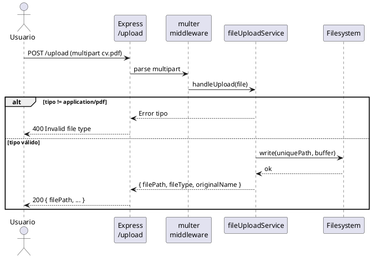
```plantuml
@startuml CU-03 Subir CV
actor Usuario as U
participant "Express\n/upload" as R
participant "multer\nmiddleware" as MW
participant "fileUploadService" as S
participant "Filesystem" as FS

U -> R : POST /upload (multipart cv.pdf)
R -> MW : parse multipart
MW -> S : handleUpload(file)

alt tipo != application/pdf
  S --> R : Error tipo
  R --> U : 400 Invalid file type
else tipo válido
  S -> FS : write(uniquePath, buffer)
  FS --> S : ok
  S --> R : { filePath, fileType, originalName }
  R --> U : 200 { filePath, ... }
end
@enduml
```

---

### 2.6 CU-04 · Listar candidatos por posición (Kanban)

| Campo | Valor |
|-------|-------|
| **ID / Nombre** | CU-04 · Listar candidatos por posición para tablero Kanban |
| **Endpoint** | `GET /positions/:id/candidates` |
| **Estado** | ❌ Pendiente |
| **Prioridad** | Must |
| **Actor principal** | Reclutador |

**Descripción.** Devuelve, para una posición, todos los candidatos en proceso (todas las `Application` con `positionId = :id`) con la información mínima necesaria para pintar las tarjetas del tablero Kanban: nombre completo, fase actual y puntuación media de entrevistas.

**Precondiciones.**

- Existe la posición con `:id`.
- Pueden existir 0..N `Application` asociadas.

**Postcondiciones.**

- Respuesta `200` con array (posiblemente vacío) de candidatos enriquecidos.

**Flujo principal.**

1. Cliente envía `GET /positions/42/candidates`.
2. Router → controller → service.
3. Service ejecuta `prisma.application.findMany({ where: { positionId: 42 }, include: { candidate: true, currentInterviewStep: true, interviews: true } })`.
4. Por cada `application`, calcula `avgScore = avg(interviews.score)` excluyendo nulls.
5. Mapea a DTO: `{ candidateId, fullName, current_interview_step, average_score }`.
6. Responde `200` con el array.

**Flujos alternativos.**

- **A1 — Posición inexistente:** `404 Position not found` (verificar existencia antes del findMany). *Decisión a confirmar: alternativamente devolver `200 []`.*
- **A2 — Sin candidatos:** `200 []`.
- **A3 — id no numérico:** `400`.

**Reglas de negocio.**

- "Candidato en proceso" = existe registro en `Application` para esa `Position` (V1 no filtra por estado activo; el modelo no lo distingue todavía).
- `current_interview_step` se obtiene del FK `Application.currentInterviewStep` → `InterviewStep.name`.
- `average_score` excluye entrevistas con `score IS NULL`. Si no hay entrevistas con score, valor = `null`. *Decisión a confirmar: alternativa devolver `0`.*

**Criterios de aceptación.**

```gherkin
Feature: Listar candidatos por posición

  Scenario: Posición con candidatos
    Given Position 42 con 3 Applications
      And el candidato A tiene 2 entrevistas con scores [4, 5]
      And el candidato B tiene 0 entrevistas con score
    When envío GET /positions/42/candidates
    Then la respuesta es 200
      And contiene 3 elementos
      And el candidato A trae fullName, current_interview_step y average_score = 4.5
      And el candidato B trae average_score = null

  Scenario: Posición sin candidatos
    Given Position 50 sin Applications
    When envío GET /positions/50/candidates
    Then la respuesta es 200
      And el cuerpo es []

  Scenario: Posición inexistente
    When envío GET /positions/9999/candidates
    Then la respuesta es 404
```

**Requisitos no funcionales.**

- **Rendimiento:** P95 < 300 ms con hasta 200 candidatos y 5 entrevistas/candidato.
- **N+1:** evitar consulta por candidato; usar `include` o `groupBy` con `_avg`.
- **Paginación (futuro):** no contemplada en V1, pero diseñar contrato dejando margen para `?page&pageSize`.
- **Seguridad:** debe requerir auth y autorización (reclutador con acceso a la posición).

**Métricas de éxito.**

- Tiempo de carga del Kanban < 1 s end-to-end.
- 0 errores 5xx en producción.

**Edge cases.**

- `Application` con `currentInterviewStep` nulo → mapear a "No Asignado".
- Score con decimales → devolver número (no string), precisión 2 decimales.
- Candidato con varias `Application` para la misma `Position` → no debería ocurrir; verificar regla de unicidad.

**Dependencias técnicas.**

- Modelos: `Application`, `Candidate`, `InterviewStep`, `Interview`.
- Nuevo: `routes/positionRoutes`, `presentation/controllers/positionController`, `application/services/positionService`.
- Sin servicios externos.

**Diagrama UML de secuencia.**

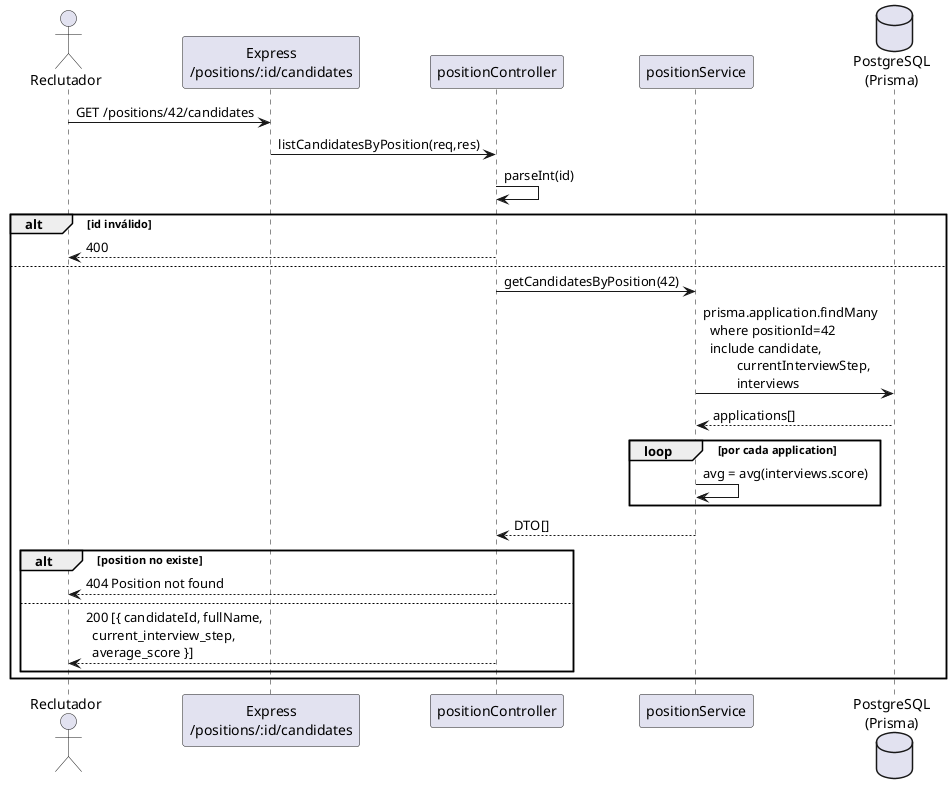
```plantuml
@startuml CU-04 Listar candidatos por posición
actor Reclutador as U
participant "Express\n/positions/:id/candidates" as R
participant "positionController" as C
participant "positionService" as S
database "PostgreSQL\n(Prisma)" as DB

U -> R : GET /positions/42/candidates
R -> C : listCandidatesByPosition(req,res)
C -> C : parseInt(id)

alt id inválido
  C --> U : 400
else
  C -> S : getCandidatesByPosition(42)
  S -> DB : prisma.application.findMany\n  where positionId=42\n  include candidate,\n          currentInterviewStep,\n          interviews
  DB --> S : applications[]
  loop por cada application
    S -> S : avg = avg(interviews.score)
  end
  S --> C : DTO[]
  alt position no existe
    C --> U : 404 Position not found
  else
    C --> U : 200 [{ candidateId, fullName,\n  current_interview_step,\n  average_score }]
  end
end
@enduml
```

---

### 2.7 CU-05 · Actualizar fase del candidato

| Campo | Valor |
|-------|-------|
| **ID / Nombre** | CU-05 · Actualizar fase del candidato (mover tarjeta en Kanban) |
| **Endpoint** | `PUT /candidates/:id/stage` |
| **Estado** | ❌ Pendiente |
| **Prioridad** | Must |
| **Actor principal** | Reclutador |

**Descripción.** Cambia la fase actual (`currentInterviewStep`) de la `Application` asociada al candidato dentro del flujo de la posición. Es la operación que dispara el drag&drop entre columnas del tablero Kanban.

**Precondiciones.**

- Existe el candidato `:id` y tiene una `Application` para una posición concreta.
- Existe el `InterviewStep` destino y pertenece al `InterviewFlow` de esa posición.

**Postcondiciones.**

- `Application.currentInterviewStep` actualizado al nuevo step.
- (Opcional, futuro) registrar la transición en bitácora.

**Flujo principal.**

1. Cliente envía `PUT /candidates/42/stage` con cuerpo `{ applicationId, newInterviewStepId }`. *Contrato del body a confirmar; alternativa: `{ positionId, newInterviewStepId }`.*
2. Router → controller → service.
3. Service valida que el candidato tiene esa `Application`.
4. Service valida que el `newInterviewStepId` pertenece al `InterviewFlow` de la posición de la `Application`.
5. `prisma.application.update({ where: { id: applicationId }, data: { currentInterviewStep: newInterviewStepId } })`.
6. Responde `200 { applicationId, currentInterviewStep }`.

**Flujos alternativos.**

- **A1 — Application no encontrada o no pertenece al candidato:** `404`.
- **A2 — Step destino no pertenece al flow de la posición:** `400 Invalid step for this position`.
- **A3 — id no numérico:** `400`.
- **A4 — Body inválido:** `400`.

**Reglas de negocio.**

- El step destino debe existir en el `InterviewFlow` de la posición de la `Application`.
- La transición es libre entre cualquier par de steps del mismo flow (el modelo no impone orden estricto). *V1 = no bloquear retrocesos.*
- La columna inicial "No Asignado" es lógica: corresponde a `Application` con `currentInterviewStep` nulo o a un step con nombre "No Asignado". *Decisión a confirmar.*

**Criterios de aceptación.**

```gherkin
Feature: Mover candidato entre fases

  Scenario: Movimiento válido
    Given una Application 100 del candidato 7 en Position 42
      And la Position 42 usa InterviewFlow con steps [Screening, Technical, Offer]
      And el step destino "Technical" pertenece a ese flow
    When envío PUT /candidates/7/stage con
         { applicationId: 100, newInterviewStepId: <id Technical> }
    Then la respuesta es 200
      And Application 100 tiene currentInterviewStep = Technical

  Scenario: Step destino de otro flow
    Given una Application 100 con flow A
      And un InterviewStep <id> que pertenece al flow B
    When envío PUT /candidates/7/stage con ese step
    Then la respuesta es 400

  Scenario: Application no pertenece al candidato
    Given Application 100 del candidato 7
    When envío PUT /candidates/9/stage con { applicationId: 100, ... }
    Then la respuesta es 404
```

**Requisitos no funcionales.**

- **Rendimiento:** P95 < 200 ms.
- **Concurrencia:** dos drag&drop simultáneos sobre la misma `Application` → último write gana. *Optimistic locking (`version`) queda como mejora futura.*
- **Seguridad:** auth + autorización (el reclutador debe tener permiso sobre la posición).
- **Auditabilidad (futuro):** log de quién mueve, cuándo y de qué fase a qué fase.

**Métricas de éxito.**

- Latencia P95 < 200 ms.
- Tasa de error < 1%.
- 0 inconsistencias detectadas (step destino ajeno al flow) en producción.

**Edge cases.**

- Mover a la misma fase actual → idempotente, `200` sin cambios.
- `Application` con `currentInterviewStep` nulo (estado "No Asignado") → permitir asignación inicial.
- Candidato con múltiples `Application` (varias posiciones) → la operación afecta solo a la `Application` indicada por `applicationId`.

**Dependencias técnicas.**

- Modelos: `Application`, `InterviewStep`, `InterviewFlow`, `Position`, `Candidate`.
- Nuevas piezas: extensión de `candidateRoutes` (o nuevo `applicationRoutes`), controller y service.

**Diagrama UML de secuencia.**

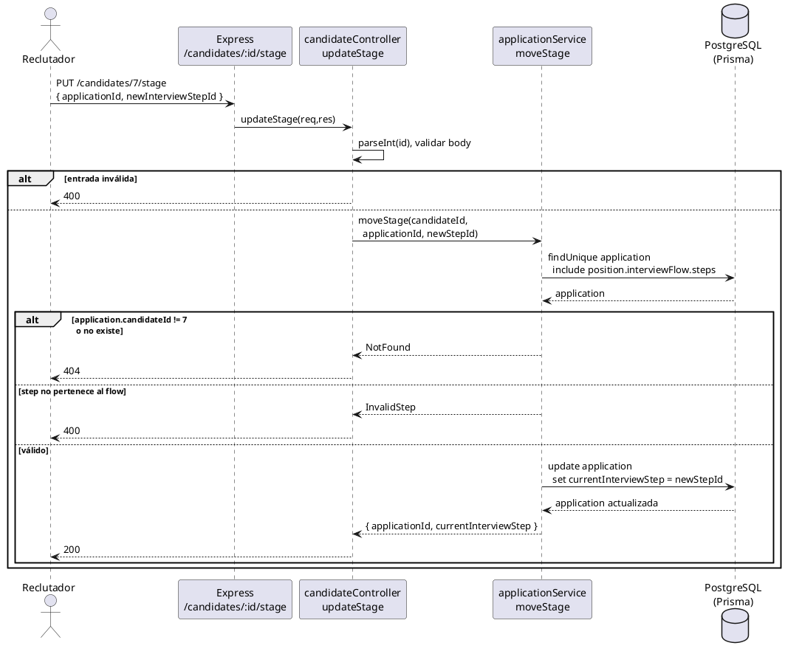
```plantuml
@startuml CU-05 Actualizar fase del candidato
actor Reclutador as U
participant "Express\n/candidates/:id/stage" as R
participant "candidateController\nupdateStage" as C
participant "applicationService\nmoveStage" as S
database "PostgreSQL\n(Prisma)" as DB

U -> R : PUT /candidates/7/stage\n{ applicationId, newInterviewStepId }
R -> C : updateStage(req,res)
C -> C : parseInt(id), validar body

alt entrada inválida
  C --> U : 400
else
  C -> S : moveStage(candidateId,\n  applicationId, newStepId)
  S -> DB : findUnique application\n  include position.interviewFlow.steps
  DB --> S : application
  alt application.candidateId != 7\n  o no existe
    S --> C : NotFound
    C --> U : 404
  else step no pertenece al flow
    S --> C : InvalidStep
    C --> U : 400
  else válido
    S -> DB : update application\n  set currentInterviewStep = newStepId
    DB --> S : application actualizada
    S --> C : { applicationId, currentInterviewStep }
    C --> U : 200
  end
end
@enduml
```

---

### 2.8 Decisiones pendientes a confirmar con producto

Decisiones detectadas durante la redacción del PRD que requieren validación antes de implementar los CUs pendientes:

| # | Decisión | CUs afectados | Default propuesto |
|---|----------|---------------|-------------------|
| D1 | Posición inexistente en CU-04: ¿`404` o `200 []`? | CU-04 | `404` (más informativo) |
| D2 | `average_score` cuando no hay entrevistas con score: ¿`null` o `0`? | CU-04 | `null` (semánticamente correcto) |
| D3 | Contrato del body en `PUT /candidates/:id/stage`: ¿`{applicationId,...}` o `{positionId,...}`? | CU-05 | `applicationId` (un candidato puede tener varias `Application`) |
| D4 | "No Asignado" como `currentInterviewStep` nulo o como `InterviewStep` con `name = "No Asignado"`? | CU-04, CU-05 | Step explícito (más simple en queries) |
| D5 | ¿Bloquear retrocesos de fase en V1? | CU-05 | No bloquear (libre entre steps del flow) |
| D6 | ¿`GET /candidates/:id` debe incluir educations/workExperiences/applications? | CU-02 | Incluirlas para evitar round-trips desde el frontend |

---

> **Próximos pasos del documento**: desarrollo de los puntos 4–8 (modelo de datos Prisma comentado, OpenSpecs de la API, historias de usuario, tickets y PRs). El punto 3 queda cubierto a continuación.

---

## 3. Arquitectura del sistema

> **Alcance del capítulo.** Documenta el estado **as-is** (lo que existe hoy en el repo), el estado **to-be** (arquitectura objetivo hexagonal alineada con los principios declarados) y el plan de migración incremental entre ambos. Las decisiones que requieren producto/negocio se marcan como Open Questions en cada subsección. Auth/RBAC y multi-tenant se listan como gaps conocidos (3.14) — su diseño detallado queda fuera de este documento.

### 3.1 Vista de contexto (C4 — Nivel 1)

LTI es un sistema cerrado, instalado on-premise, con dos actores humanos primarios y un conjunto reducido de sistemas externos previstos (no implementados todavía).

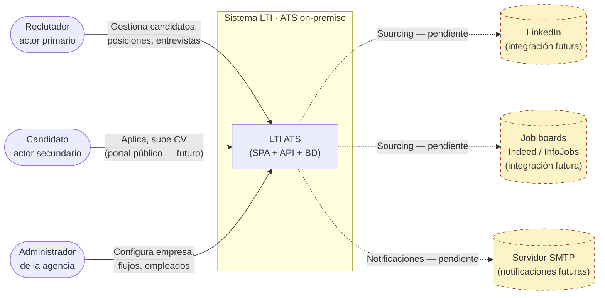
```mermaid
flowchart LR
    Recruiter([Reclutador<br/>actor primario])
    Candidate([Candidato<br/>actor secundario])
    Admin([Administrador<br/>de la agencia])

    subgraph LTI["Sistema LTI · ATS on-premise"]
        Core["LTI ATS<br/>(SPA + API + BD)"]
    end

    LinkedIn[("LinkedIn<br/>(integración futura)")]:::ext
    JobBoards[("Job boards<br/>Indeed / InfoJobs<br/>(integración futura)")]:::ext
    SMTP[("Servidor SMTP<br/>(notificaciones futuras)")]:::ext

    Recruiter -- "Gestiona candidatos,<br/>posiciones, entrevistas" --> Core
    Candidate -- "Aplica, sube CV<br/>(portal público — futuro)" --> Core
    Admin -- "Configura empresa,<br/>flujos, empleados" --> Core

    Core -. "Sourcing — pendiente" .-> LinkedIn
    Core -. "Sourcing — pendiente" .-> JobBoards
    Core -. "Notificaciones — pendiente" .-> SMTP

    classDef ext fill:#fef3c7,stroke:#92400e,stroke-dasharray:5 5
```

**Notas:**
- Los sistemas externos están dibujados con borde discontinuo porque hoy **ninguno está integrado** (ver 1.6).
- El portal público de candidato existe como concepto en el PRD pero no como UI implementada.

---

### 3.2 Vista de contenedores (C4 — Nivel 2)

Despliegue típico on-premise: un host Docker con tres contenedores principales (SPA, API, BD) y un volumen para los CV. La SPA y la API hablan HTTP/JSON; la API y la BD hablan TCP/Prisma.

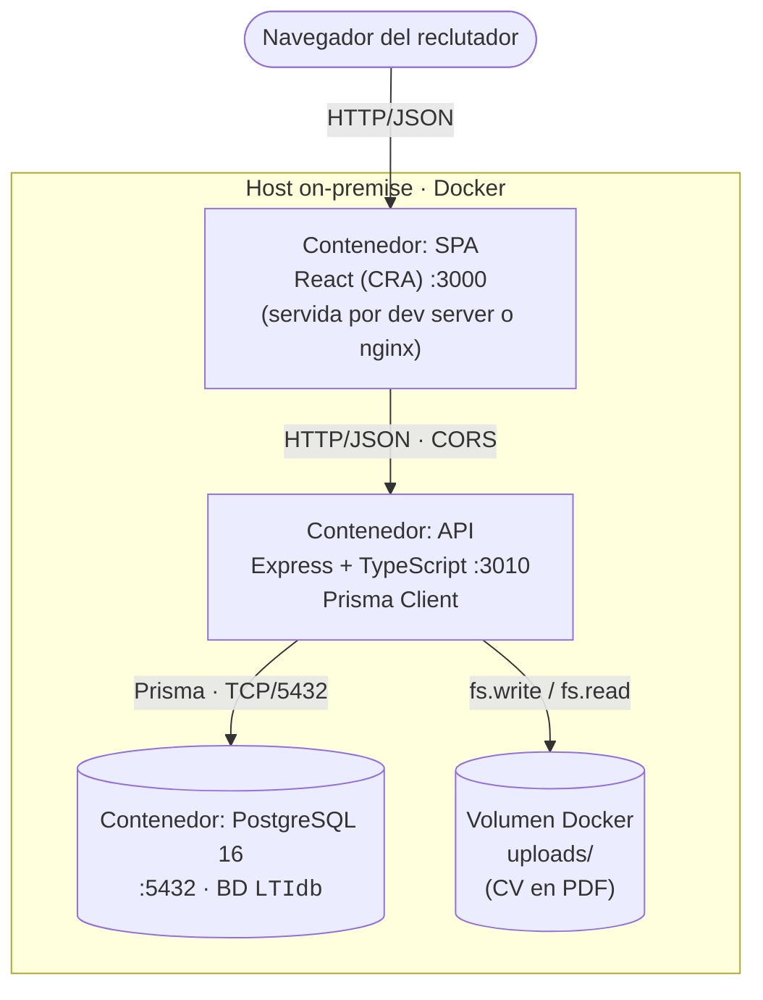
```mermaid
flowchart TB
    Browser([Navegador del reclutador])

    subgraph Host["Host on-premise · Docker"]
        SPA["Contenedor: SPA<br/>React (CRA) :3000<br/>(servida por dev server o nginx)"]
        API["Contenedor: API<br/>Express + TypeScript :3010<br/>Prisma Client"]
        DB[("Contenedor: PostgreSQL 16<br/>:5432 · BD <code>LTIdb</code>")]
        FS[("Volumen Docker<br/>uploads/<br/>(CV en PDF)")]
    end

    Browser -- "HTTP/JSON" --> SPA
    SPA -- "HTTP/JSON · CORS" --> API
    API -- "Prisma · TCP/5432" --> DB
    API -- "fs.write / fs.read" --> FS
```

**Decisiones de despliegue:**
- **Single-host Docker Compose** es el modelo soportado hoy. Para producción real se recomienda separar la BD a un servicio gestionado interno o contenedor con volumen persistente, y servir la SPA desde un nginx/Caddy en lugar del dev server de CRA.
- **CORS abierto a `localhost:3000`** en `index.ts` — adecuado para dev, debe restringirse en producción.

---

### 3.3 Vista de componentes — As-is (estado actual)

Lo que **realmente** hay hoy en el repo. La estructura sigue una separación por capas tipo DDD, pero los modelos de dominio implementan **Active Record**: `Candidate.save()` invoca `prisma.candidate.create` directamente. No existe la carpeta `infrastructure/`.

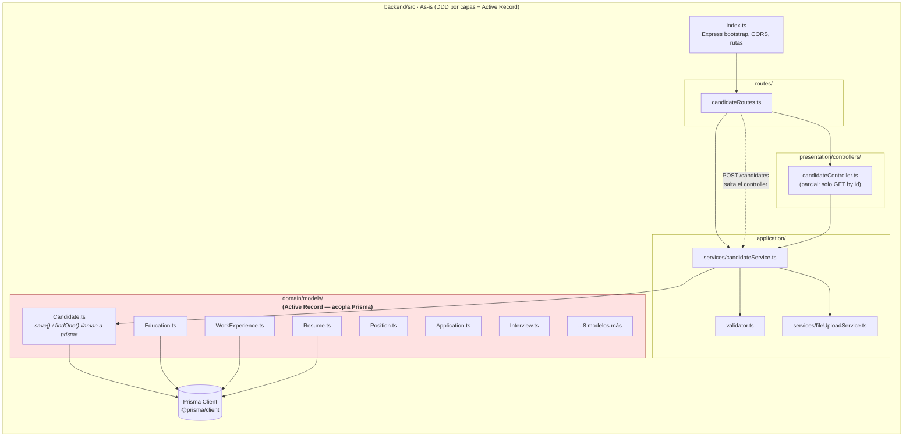
```mermaid
flowchart TB
    subgraph Backend["backend/src · As-is (DDD por capas + Active Record)"]
        direction TB

        Index["index.ts<br/>Express bootstrap, CORS, rutas"]

        subgraph RoutesLayer["routes/"]
            CandRoutes["candidateRoutes.ts"]
        end

        subgraph PresLayer["presentation/controllers/"]
            CandController["candidateController.ts<br/>(parcial: solo GET by id)"]
        end

        subgraph AppLayer["application/"]
            CandService["services/candidateService.ts"]
            FileService["services/fileUploadService.ts"]
            Validator["validator.ts"]
        end

        subgraph DomainLayer["domain/models/<br/><b>(Active Record — acopla Prisma)</b>"]
            CandModel["Candidate.ts<br/><i>save() / findOne() llaman a prisma</i>"]
            Edu["Education.ts"]
            Work["WorkExperience.ts"]
            Resume["Resume.ts"]
            Position["Position.ts"]
            App["Application.ts"]
            Interview["Interview.ts"]
            Other["...8 modelos más"]
        end

        Prisma[("Prisma Client<br/>@prisma/client")]
    end

    Index --> CandRoutes
    CandRoutes --> CandService
    CandRoutes -.->|"POST /candidates<br/>salta el controller"| CandService
    CandRoutes --> CandController
    CandController --> CandService
    CandService --> Validator
    CandService --> CandModel
    CandService --> FileService
    CandModel --> Prisma
    Edu --> Prisma
    Work --> Prisma
    Resume --> Prisma

    classDef warn fill:#fee2e2,stroke:#991b1b
    class DomainLayer warn
```

**Observaciones (verificadas en código):**
- `domain/models/*.ts` violan DIP: el dominio depende de `@prisma/client`.
- No hay `infrastructure/` → la "capa de infraestructura" anunciada en `docs/project.md` no existe físicamente.
- `candidateController` solo tiene `getCandidateById`; el `POST /candidates` está cableado directamente del router al service.
- Solo el módulo Candidates tiene rutas/servicios — los otros 11 modelos están "huérfanos".

---

### 3.4 Arquitectura objetivo — To-be (hexagonal por bounded context)

La arquitectura objetivo aplica **Ports & Adapters** + **DDD táctico**. Cada bounded context expone:

- **Dominio** puro (entidades, value objects, reglas) sin dependencias externas.
- **Puertos primarios** (driving): casos de uso que la aplicación ofrece al exterior.
- **Puertos secundarios** (driven): contratos que el dominio necesita del mundo (persistencia, ficheros, mensajería).
- **Adaptadores primarios**: HTTP REST (Express), CLI futura, jobs.
- **Adaptadores secundarios**: Prisma (PostgreSQL), filesystem, integraciones externas.

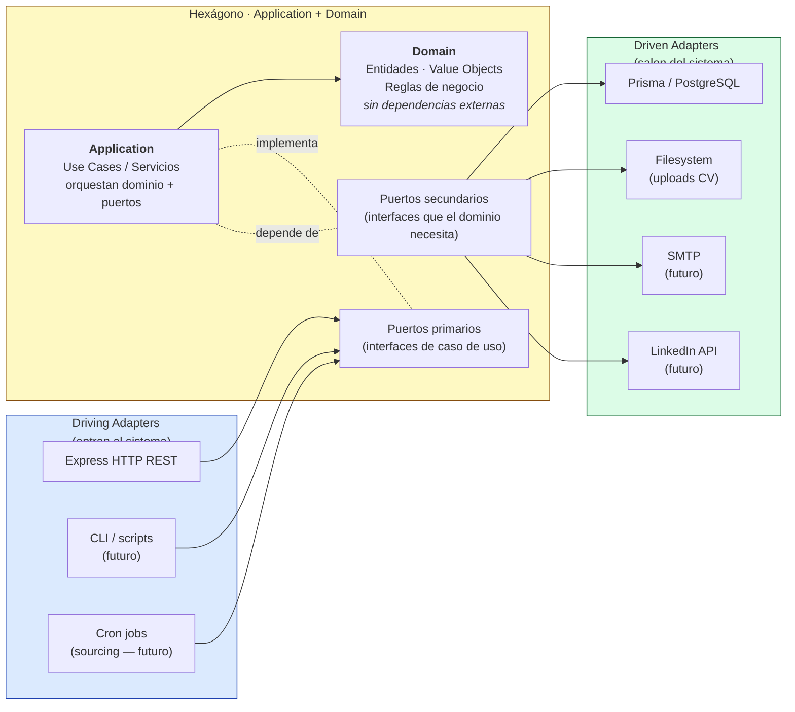
```mermaid
flowchart LR
    direction LR

    subgraph DrivingAdapters["Driving Adapters<br/>(entran al sistema)"]
        REST["Express HTTP REST"]
        CLI["CLI / scripts<br/>(futuro)"]
        Cron["Cron jobs<br/>(sourcing — futuro)"]
    end

    subgraph Hexagon["Hexágono · Application + Domain"]
        direction TB
        UseCases["<b>Application</b><br/>Use Cases / Servicios<br/>orquestan dominio + puertos"]
        Domain["<b>Domain</b><br/>Entidades · Value Objects<br/>Reglas de negocio<br/><i>sin dependencias externas</i>"]
        PortsIn["Puertos primarios<br/>(interfaces de caso de uso)"]
        PortsOut["Puertos secundarios<br/>(interfaces que el dominio necesita)"]

        UseCases --> Domain
        UseCases -. implementa .- PortsIn
        UseCases -. depende de .- PortsOut
    end

    subgraph DrivenAdapters["Driven Adapters<br/>(salen del sistema)"]
        Prisma["Prisma / PostgreSQL"]
        FS["Filesystem<br/>(uploads CV)"]
        SMTP["SMTP<br/>(futuro)"]
        Linked["LinkedIn API<br/>(futuro)"]
    end

    REST --> PortsIn
    CLI --> PortsIn
    Cron --> PortsIn

    PortsOut --> Prisma
    PortsOut --> FS
    PortsOut --> SMTP
    PortsOut --> Linked

    classDef driving fill:#dbeafe,stroke:#1e40af
    classDef driven fill:#dcfce7,stroke:#166534
    classDef hex fill:#fef9c3,stroke:#854d0e
    class DrivingAdapters driving
    class DrivenAdapters driven
    class Hexagon hex
```

**Reglas de dependencia (estrictas, verificables con linters tipo `dependency-cruiser`):**

| Capa | Puede depender de | NO puede depender de |
|------|-------------------|----------------------|
| `domain/` | nada externo (solo lenguaje) | application, infrastructure, presentation, prisma, express |
| `application/` | `domain/` (entidades + puertos) | infrastructure, presentation, prisma, express |
| `infrastructure/` | `domain/` (puertos secundarios), librerías técnicas | application |
| `presentation/` | `application/` (puertos primarios), `domain/` (DTOs) | infrastructure |

---

### 3.5 Bounded contexts

División acordada: **5 contextos** alineados con los grupos funcionales del producto y los endpoints REST existentes/futuros.

| Contexto | Entidades del schema actual | Casos de uso clave |
|----------|------------------------------|---------------------|
| **Candidates** | `Candidate`, `Education`, `WorkExperience`, `Resume` | Alta de candidato (CU-01), consulta (CU-02), upload de CV (CU-03) |
| **Positions** | `Position` | CRUD de posiciones, listar visibles (portal público — futuro) |
| **Applications** | `Application` (+ FK a `InterviewStep`) | Listar candidatos por posición (CU-04), mover entre fases (CU-05) |
| **Interviews** | `Interview`, `InterviewFlow`, `InterviewStep`, `InterviewType` | Registrar entrevista, calcular score medio, definir flujos |
| **Catalog** | `Company`, `Employee` | Soporte: clientes y entrevistadores |

**Razón de la división:** mantiene Candidates y Positions como contextos primarios independientes, separa **Applications** (proceso) de **Interviews** (registro de entrevistas) porque tienen ciclos de vida y consumidores distintos (Kanban vs. evaluación), y aísla **Catalog** como contexto de soporte (sin reglas complejas).

**Relaciones entre contextos** (siguen el grafo del schema Prisma):

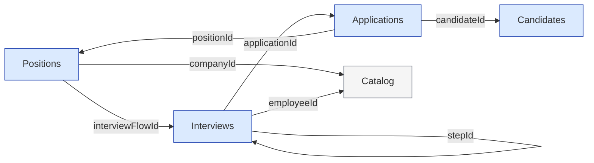
```mermaid
flowchart LR
    Cand[Candidates]
    Pos[Positions]
    App[Applications]
    Inter[Interviews]
    Cat[Catalog]

    App -- "candidateId" --> Cand
    App -- "positionId" --> Pos
    Pos -- "companyId" --> Cat
    Inter -- "applicationId" --> App
    Inter -- "employeeId" --> Cat
    Inter -- "stepId" --> Inter
    Pos -- "interviewFlowId" --> Inter

    classDef primary fill:#dbeafe,stroke:#1e40af
    classDef support fill:#f5f5f5,stroke:#6b7280
    class Cand,Pos,App,Inter primary
    class Cat support
```

> **Nota:** `Pos -- interviewFlowId --> Inter` es la dependencia más débil del grafo. `InterviewFlow` podría considerarse un **shared kernel** entre Positions e Interviews, o moverse a un contexto "Workflows" dedicado si crece. Para V1 lo mantenemos en Interviews (es donde se evalúa).

---

### 3.6 Componentes backend — To-be detallado

Estructura de carpetas objetivo (cada bounded context replica el patrón):

```
backend/src/
├── shared/                          ← cross-cutting: errors, types, di container
├── candidates/
│   ├── domain/
│   │   ├── entities/
│   │   │   └── Candidate.ts         (entidad pura, sin Prisma)
│   │   ├── value-objects/
│   │   │   └── Email.ts
│   │   └── ports/
│   │       └── CandidateRepository.ts   ← interfaz, secundario
│   ├── application/
│   │   ├── ports/                       ← puertos primarios (use case interfaces)
│   │   │   ├── CreateCandidate.ts
│   │   │   └── GetCandidate.ts
│   │   └── use-cases/
│   │       ├── CreateCandidateService.ts
│   │       └── GetCandidateService.ts
│   ├── infrastructure/
│   │   └── persistence/prisma/
│   │       ├── PrismaCandidateRepository.ts   ← adaptador secundario
│   │       └── mappers/
│   └── presentation/
│       ├── http/
│       │   ├── CandidateController.ts
│       │   └── candidateRoutes.ts
│       └── dto/
├── positions/        ← misma estructura
├── applications/     ← misma estructura
├── interviews/       ← misma estructura
├── catalog/          ← misma estructura
└── index.ts          ← composition root: instancia adaptadores e inyecta puertos
```

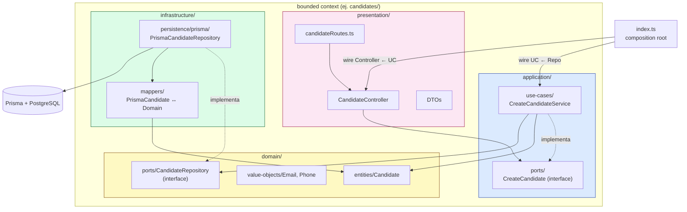
```mermaid
flowchart TB
    direction TB

    subgraph BC["bounded context (ej. candidates/)"]
        direction TB

        subgraph Pres["presentation/"]
            HttpCtrl["CandidateController"]
            HttpRoutes["candidateRoutes.ts"]
            DTO["DTOs"]
        end

        subgraph App["application/"]
            UCPort["ports/<br/>CreateCandidate (interface)"]
            UCImpl["use-cases/<br/>CreateCandidateService"]
        end

        subgraph Dom["domain/"]
            Entity["entities/Candidate"]
            VO["value-objects/Email, Phone"]
            RepoPort["ports/CandidateRepository<br/>(interface)"]
        end

        subgraph Infra["infrastructure/"]
            PrismaRepo["persistence/prisma/<br/>PrismaCandidateRepository"]
            Mapper["mappers/<br/>PrismaCandidate ↔ Domain"]
        end
    end

    Root["index.ts<br/>composition root"]
    Prisma[("Prisma + PostgreSQL")]

    HttpRoutes --> HttpCtrl
    HttpCtrl --> UCPort
    UCImpl -. implementa .-> UCPort
    UCImpl --> Entity
    UCImpl --> RepoPort
    PrismaRepo -. implementa .-> RepoPort
    PrismaRepo --> Mapper
    Mapper --> Entity
    PrismaRepo --> Prisma

    Root -- "wire UC ← Repo" --> UCImpl
    Root -- "wire Controller ← UC" --> HttpCtrl

    classDef domain fill:#fef9c3,stroke:#854d0e
    classDef app fill:#dbeafe,stroke:#1e40af
    classDef infra fill:#dcfce7,stroke:#166534
    classDef pres fill:#fce7f3,stroke:#9d174d
    class Dom domain
    class App app
    class Infra infra
    class Pres pres
```

---

### 3.7 Diagrama global de Puertos y Adaptadores

Vista agregada de todos los bounded contexts con sus adaptadores compartidos.

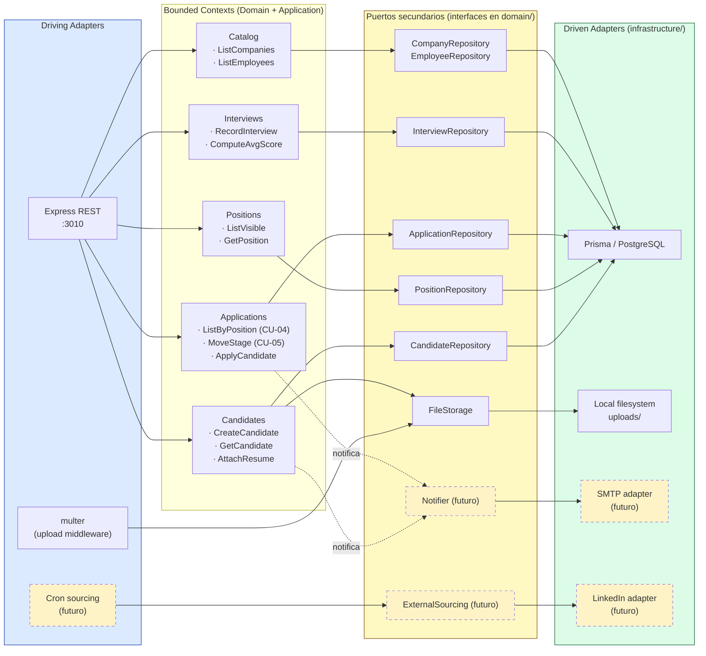
```mermaid
flowchart LR
    direction LR

    subgraph DrivingAdapters["Driving Adapters"]
        Express["Express REST<br/>:3010"]
        Multer["multer<br/>(upload middleware)"]
        Future1["Cron sourcing<br/>(futuro)"]
    end

    subgraph Cores["Bounded Contexts (Domain + Application)"]
        direction TB
        Cands["Candidates<br/>· CreateCandidate<br/>· GetCandidate<br/>· AttachResume"]
        Poss["Positions<br/>· ListVisible<br/>· GetPosition"]
        Apps["Applications<br/>· ListByPosition (CU-04)<br/>· MoveStage (CU-05)<br/>· ApplyCandidate"]
        Inters["Interviews<br/>· RecordInterview<br/>· ComputeAvgScore"]
        Cat["Catalog<br/>· ListCompanies<br/>· ListEmployees"]
    end

    subgraph Ports["Puertos secundarios (interfaces en domain/)"]
        direction TB
        RepoCand["CandidateRepository"]
        RepoPos["PositionRepository"]
        RepoApp["ApplicationRepository"]
        RepoInt["InterviewRepository"]
        RepoCat["CompanyRepository<br/>EmployeeRepository"]
        Storage["FileStorage"]
        Notif["Notifier (futuro)"]
        ExtSrc["ExternalSourcing (futuro)"]
    end

    subgraph DrivenAdapters["Driven Adapters (infrastructure/)"]
        PrismaA["Prisma / PostgreSQL"]
        FsA["Local filesystem<br/>uploads/"]
        SmtpA["SMTP adapter<br/>(futuro)"]
        LinkedinA["LinkedIn adapter<br/>(futuro)"]
    end

    Express --> Cands
    Express --> Poss
    Express --> Apps
    Express --> Inters
    Express --> Cat
    Multer --> Storage
    Future1 --> ExtSrc

    Cands --> RepoCand
    Cands --> Storage
    Poss --> RepoPos
    Apps --> RepoApp
    Inters --> RepoInt
    Cat --> RepoCat

    Cands -. notifica .-> Notif
    Apps -. notifica .-> Notif

    RepoCand --> PrismaA
    RepoPos --> PrismaA
    RepoApp --> PrismaA
    RepoInt --> PrismaA
    RepoCat --> PrismaA
    Storage --> FsA
    Notif --> SmtpA
    ExtSrc --> LinkedinA

    classDef driving fill:#dbeafe,stroke:#1e40af
    classDef driven fill:#dcfce7,stroke:#166534
    classDef ports fill:#fef9c3,stroke:#854d0e
    classDef futureNode stroke-dasharray:5 5,fill:#fef3c7
    class DrivingAdapters driving
    class DrivenAdapters driven
    class Ports ports
    class Future1,SmtpA,LinkedinA,Notif,ExtSrc futureNode
```

---

### 3.8 Hexagonal por módulo

Ficha breve de cada bounded context: responsabilidad, puertos primarios y secundarios.

#### 3.8.1 Candidates

- **Responsabilidad:** ciclo de vida del candidato y su CV/educación/experiencia. Garantiza unicidad por email.
- **Estado:** parcialmente implementado (CU-01, CU-02, CU-03 existen — refactor pendiente para hexagonal).

| Tipo | Puerto | Descripción |
|------|--------|-------------|
| Primario | `CreateCandidate` | Alta con educations, workExperiences, cv |
| Primario | `GetCandidate` | Lookup por id |
| Primario | `AttachResume` | Asocia CV a candidato existente |
| Secundario | `CandidateRepository` | Persistencia (`save`, `findById`, `findByEmail`) |
| Secundario | `FileStorage` | Compartido con Applications |

**Reglas de dominio relevantes:**
- `Email` es value object con validación de formato.
- `Education.endDate >= startDate` cuando ambas existen (validar en VO `DateRange`).
- Un candidato puede tener N `Resume` (histórico); el CV "actual" es el último por `uploadDate`.

#### 3.8.2 Positions

- **Responsabilidad:** gestionar posiciones abiertas de las empresas cliente y su exposición pública.
- **Estado:** modelo existe en Prisma; sin rutas ni servicios.

| Tipo | Puerto | Descripción |
|------|--------|-------------|
| Primario | `CreatePosition` | Alta de posición vinculada a `Company` y `InterviewFlow` |
| Primario | `ListVisiblePositions` | Para portal público (`isVisible = true`) |
| Primario | `GetPosition` | Detalle |
| Secundario | `PositionRepository` | Persistencia |
| Secundario | `CompanyRepository` (Catalog) | Validar `companyId` |
| Secundario | `InterviewFlowRepository` (Interviews) | Validar `interviewFlowId` |

**Reglas:**
- `status` ∈ {`Draft`, `Open`, `Closed`} — el modelo actual no lo restringe; elevar a enum en domain.
- `salaryMax >= salaryMin` cuando ambas existen.

#### 3.8.3 Applications (núcleo del Kanban)

- **Responsabilidad:** representar la candidatura de un candidato a una posición y su fase actual del flujo. Es el corazón del tablero Kanban.
- **Estado:** modelo en Prisma; CU-04 y CU-05 pendientes.

| Tipo | Puerto | Descripción |
|------|--------|-------------|
| Primario | `ApplyCandidate` | Crear `Application(candidateId, positionId)` en step inicial |
| Primario | `ListCandidatesByPosition` | **CU-04** — devuelve nombre, fase, score medio |
| Primario | `MoveCandidateStage` | **CU-05** — actualiza `currentInterviewStep` validando que el step pertenece al `InterviewFlow` de la posición |
| Secundario | `ApplicationRepository` | Persistencia |
| Secundario | `InterviewStepRepository` (Interviews) | Validar pertenencia al flow |
| Secundario | `InterviewRepository` (Interviews) | Calcular `avgScore` |

**Reglas:**
- Un candidato no debería tener > 1 `Application` activa para la misma posición (regla a confirmar — D1 del PRD).
- El step destino debe pertenecer al `InterviewFlow` de la `Position`. Esto es la **invariante crítica** del Kanban.

#### 3.8.4 Interviews

- **Responsabilidad:** registrar entrevistas, mantener flujos (`InterviewFlow`), pasos (`InterviewStep`) y tipos (`InterviewType`), y calcular agregados (score medio).
- **Estado:** modelo en Prisma; sin rutas ni servicios.

| Tipo | Puerto | Descripción |
|------|--------|-------------|
| Primario | `RecordInterview` | Crear `Interview` con score/result/notes |
| Primario | `ComputeAverageScore` | Para una `Application`, score medio excluyendo nulls |
| Primario | `DefineInterviewFlow` | Crear `InterviewFlow` + `InterviewStep`s ordenados |
| Secundario | `InterviewRepository`, `InterviewFlowRepository`, `InterviewStepRepository`, `InterviewTypeRepository` | Persistencia |
| Secundario | `EmployeeRepository` (Catalog) | Validar entrevistador |

**Reglas:**
- `score` ∈ [0, 5] o [0, 10] (a confirmar con producto). El modelo actual lo deja como `Int?` libre.
- `orderIndex` define el orden visual del Kanban — debe ser único dentro de un mismo `interviewFlowId`.

#### 3.8.5 Catalog

- **Responsabilidad:** gestionar empresas cliente y empleados (entrevistadores). Contexto de soporte sin reglas complejas.
- **Estado:** modelo en Prisma; sin rutas.

| Tipo | Puerto | Descripción |
|------|--------|-------------|
| Primario | `RegisterCompany` | Alta de empresa cliente |
| Primario | `RegisterEmployee` | Alta de empleado (entrevistador) vinculado a empresa |
| Primario | `ListCompanies`, `ListEmployees` | Lookups |
| Secundario | `CompanyRepository`, `EmployeeRepository` | Persistencia |

**Reglas:** `Company.name` único; `Employee.email` único; `Employee.isActive` filtra entrevistadores asignables.

---

### 3.9 Frontend — arquitectura hexagonal ligera

> **Estado actual:** CRA con tres componentes (`AddCandidateForm.js`, `FileUploader.js`, `RecruiterDashboard.js`) y `services/candidateService.js`. El producto declara hexagonal en frontend pero la realidad es muy temprana.

**Decisión:** aplicar hexagonal **ligero** — sin dominio rico (la verdad vive en el servidor), pero con puertos secundarios formales para HTTP y file upload, de forma que la UI sea testeable sin red.

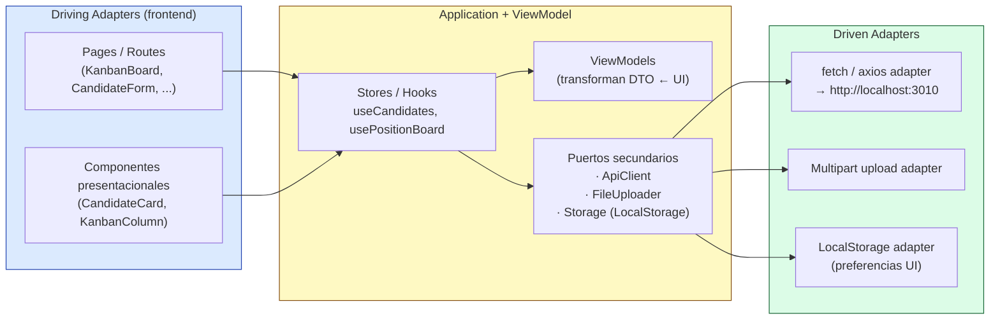
```mermaid
flowchart LR
    direction LR

    subgraph DrivingAdapters_F["Driving Adapters (frontend)"]
        Pages["Pages / Routes<br/>(KanbanBoard, CandidateForm, ...)"]
        Components["Componentes presentacionales<br/>(CandidateCard, KanbanColumn)"]
    end

    subgraph Hex_F["Application + ViewModel"]
        Stores["Stores / Hooks<br/>useCandidates, usePositionBoard"]
        VMs["ViewModels<br/>(transforman DTO ← UI)"]
        Ports_F["Puertos secundarios<br/>· ApiClient<br/>· FileUploader<br/>· Storage (LocalStorage)"]
    end

    subgraph DrivenAdapters_F["Driven Adapters"]
        Fetch["fetch / axios adapter<br/>→ http://localhost:3010"]
        Multipart["Multipart upload adapter"]
        LS["LocalStorage adapter<br/>(preferencias UI)"]
    end

    Pages --> Stores
    Components --> Stores
    Stores --> VMs
    Stores --> Ports_F

    Ports_F --> Fetch
    Ports_F --> Multipart
    Ports_F --> LS

    classDef driving fill:#dbeafe,stroke:#1e40af
    classDef driven fill:#dcfce7,stroke:#166534
    classDef hex fill:#fef9c3,stroke:#854d0e
    class DrivingAdapters_F driving
    class DrivenAdapters_F driven
    class Hex_F hex
```

**Principios:**
- Ningún componente importa `fetch` directamente. Todo va por `ApiClient` (puerto).
- Los hooks/stores reciben implementaciones por contexto/provider — facilita mock en tests con MSW o stubs.
- Hexagonal **no** justifica añadir un layer de "domain entities" en frontend — sería sobre-ingeniería.

**Roadmap mínimo para no morir en CRA:**
- Migrar todo a TypeScript (`.tsx`) — hoy hay mezcla.
- Considerar `Vite` cuando el equipo tenga ancho de banda (CRA está descontinuado oficialmente).
- Introducir routing (`react-router`) — hoy `App.tsx` no tiene rutas.

---

### 3.10 Modelo lógico de datos (ERD)

Derivado del `schema.prisma` real (12 entidades). Las cardinalidades reflejan las relaciones declaradas.

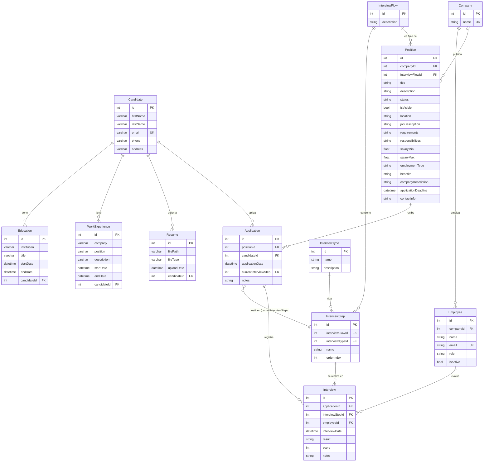
```mermaid
erDiagram
    Candidate ||--o{ Education : tiene
    Candidate ||--o{ WorkExperience : tiene
    Candidate ||--o{ Resume : adjunta
    Candidate ||--o{ Application : aplica

    Company ||--o{ Employee : emplea
    Company ||--o{ Position : publica

    InterviewFlow ||--o{ InterviewStep : contiene
    InterviewFlow ||--o{ Position : "es flujo de"
    InterviewType ||--o{ InterviewStep : "tipa"

    Position ||--o{ Application : recibe
    Application }o--|| InterviewStep : "está en (currentInterviewStep)"
    Application ||--o{ Interview : registra
    InterviewStep ||--o{ Interview : "se realiza en"
    Employee ||--o{ Interview : "evalúa"

    Candidate {
        int id PK
        varchar firstName
        varchar lastName
        varchar email UK
        varchar phone
        varchar address
    }
    Education {
        int id PK
        varchar institution
        varchar title
        datetime startDate
        datetime endDate
        int candidateId FK
    }
    WorkExperience {
        int id PK
        varchar company
        varchar position
        varchar description
        datetime startDate
        datetime endDate
        int candidateId FK
    }
    Resume {
        int id PK
        varchar filePath
        varchar fileType
        datetime uploadDate
        int candidateId FK
    }
    Company {
        int id PK
        string name UK
    }
    Employee {
        int id PK
        int companyId FK
        string name
        string email UK
        string role
        bool isActive
    }
    InterviewType {
        int id PK
        string name
        string description
    }
    InterviewFlow {
        int id PK
        string description
    }
    InterviewStep {
        int id PK
        int interviewFlowId FK
        int interviewTypeId FK
        string name
        int orderIndex
    }
    Position {
        int id PK
        int companyId FK
        int interviewFlowId FK
        string title
        string description
        string status
        bool isVisible
        string location
        string jobDescription
        string requirements
        string responsibilities
        float salaryMin
        float salaryMax
        string employmentType
        string benefits
        string companyDescription
        datetime applicationDeadline
        string contactInfo
    }
    Application {
        int id PK
        int positionId FK
        int candidateId FK
        datetime applicationDate
        int currentInterviewStep FK
        string notes
    }
    Interview {
        int id PK
        int applicationId FK
        int interviewStepId FK
        int employeeId FK
        datetime interviewDate
        string result
        int score
        string notes
    }
```

**Observaciones del modelo:**
- `Application.currentInterviewStep` es FK obligatoria (`Int`, no `Int?`) — esto contradice la sugerencia del PRD de que "No Asignado" se modele como `null`. La decisión D4 del PRD lo confirma: usar un `InterviewStep` con `name = "No Asignado"`.
- Falta índice explícito en `Application(positionId)` — necesario para el rendimiento de CU-04. Se debería añadir en una migración futura.
- No hay `createdAt` / `updatedAt` en ninguna entidad — gap conocido para auditoría.
- No hay `tenantId` — el modelo asume single-tenant (1 instalación = 1 agencia). Open question OQ1.

---

### 3.11 Plan de migración (as-is → to-be)

Refactor incremental por bounded context, sin big-bang. Cada fase es un PR independiente y deja el sistema funcional.

| Fase | Alcance | Entregables | Criterio de éxito |
|------|---------|-------------|-------------------|
| **F0** | Documentación (este change) | docs/readme.md §3, OpenSpec change | El equipo puede planificar F1+ sin reabrir decisiones |
| **F1** | Refactor de Candidates a hexagonal | `domain/ports/CandidateRepository.ts`, `infrastructure/persistence/prisma/PrismaCandidateRepository.ts`, mappers, composition root en `index.ts`. Sin cambios en endpoints. | Tests existentes pasan; modelo `Candidate` ya no importa Prisma; controlador llama a use case via puerto |
| **F2** | Implementar Applications + Positions hexagonales para desbloquear CU-04 y CU-05 | Endpoints `GET /positions/:id/candidates` y `PUT /candidates/:id/stage` directamente con patrón objetivo | Kanban funcional E2E; `dependency-cruiser` valida reglas de capa |
| **F3** | Migrar Interviews y Catalog | Repos + use cases para entrevistas y empresas/empleados | Cobertura de modelos completa; ya no queda Active Record |
| **F4** | Auth (puerto + adaptador) y RBAC | `domain/ports/AuthService.ts`, middleware Express, roles `Recruiter`/`Admin`/`Public` | Auth requerida por defecto en endpoints no públicos |

**Criterio de "hexagonal completo":** ningún fichero bajo `domain/` o `application/` importa `@prisma/client` ni `express`. Validable con `dependency-cruiser` o eslint plugin.

---

### 3.12 Stack tecnológico actual — pros y contras

| Componente | Versión | Pros | Contras |
|------------|---------|------|---------|
| **Express 4.19** | LTS | Ubicuo, mínimo, sin opiniones, excelente ecosistema de middleware. Coste de aprendizaje cero. | Sin DI, sin estructura impuesta, sin validación, sin OpenAPI nativo. Para hexagonal hay que construir el wiring a mano. **Express 5 está GA** y aporta async error handling — pendiente migrar. |
| **TypeScript 4.9** | Antiguo | Type safety en backend. Compatible con casi todo. | TS 4.9 es del 2022. Versiones recientes (5.4+) traen `satisfies`, mejoras de inference y rendimiento. **Actualizar a TS 5.x** debería ser parte de F1. |
| **Prisma 5.13** | Reciente | Schema declarativo, migraciones automáticas, type-safe queries, generación de cliente. Excelente DX. | Acoplamiento fuerte: si los modelos del dominio importan `@prisma/client`, el dominio queda atado al ORM (es lo que pasa hoy). El patrón hexagonal exige mappers `PrismaModel ↔ DomainEntity` — overhead de boilerplate. |
| **PostgreSQL 16** | Reciente | Soporta JSONB, índices parciales, FTS, replicación nativa. Estándar de facto para apps SaaS/on-premise. | Operacional: requiere DBA en producción para tuning, vacuum, backups. |
| **multer** | LTS | Solución estándar para multipart en Express. | API antigua basada en callbacks; no valida `Content-Type` real (solo extensión); para validación de PDF "real" se necesita `file-type` o similar. |
| **swagger-jsdoc + swagger-ui-express** | — | Permite documentar endpoints desde JSDoc. | Acopla la spec al código; preferible mantener `docs/openapi.yaml` como fuente única (spec-first). **Migrar a `express-openapi-validator`** valida + sirve la spec. |
| **CRA (Create React App)** | Descontinuado | Familiar, low-effort. | **Oficialmente descontinuado** desde 2023. Sin updates, builds lentos, sin HMR moderno. Migrar a Vite es trivial y debería estar en el roadmap. |
| **Docker Compose** | — | Reproducible, suficiente para single-host on-premise. | Para multi-host o HA se queda corto; en ese caso evaluar Kubernetes (probable sobre-ingeniería para una agencia de 10–30 personas). |
| **Jest + ts-jest** | LTS | Estándar de facto, abundancia de recursos. | Lento comparado con Vitest. ts-jest es más lento que `swc-jest` o nativo. Reevaluar al introducir tests masivamente. |
| **No DI container** | — | Composition root manual = simple, sin magia. | Se vuelve verboso con muchos contextos. `tsyringe` o `awilix` son opciones ligeras si crece. |
| **No auth library** | — | Aún no necesario en V1. | **Bloqueante para producción.** Passport (probado) o `jose`+JWT (moderno) son las dos vías. |

**Veredicto del stack actual:** sólido y pragmático para esta etapa. Las debilidades son corregibles sin cambiar de framework: actualizar TS, migrar a Express 5, introducir mappers Prisma↔Domain, salir de CRA y meter auth.

---

### 3.13 Stack alternativo razonado — NestJS

> **Recomendación:** NO migrar en este punto. El backend tiene poco código real, pero introducir NestJS implica reescribir lo poco que hay y cargar al equipo con boilerplate sin ROI inmediato. La alternativa se documenta como referencia para una eventual reevaluación al final de F2.

**Stack alternativo propuesto:**

- **NestJS 10.x** — framework opinionado sobre Express/Fastify, módulos, DI built-in, decoradores, soporte nativo para hexagonal/DDD.
- **Prisma 5** o **TypeORM 0.3** — ambos integrables; preferir Prisma por la curva ya pagada.
- **class-validator + class-transformer** — validación declarativa sobre DTOs.
- **Passport + Passport-JWT** — para auth (F4).
- **Swagger module nativo** — genera OpenAPI desde decoradores.
- **Vitest** o **Jest + swc** — para test runner más rápido.

**Comparativa Express+manual vs NestJS:**

| Eje | Express + montaje manual (actual) | NestJS |
|-----|-----------------------------------|--------|
| Curva inicial | Mínima | Alta (decoradores, módulos, providers) |
| DI | Manual (composition root) | Built-in, jerárquica |
| Estructura impuesta | Ninguna — flexibilidad total | Fuerte — guía pero limita |
| OpenAPI | Manual (jsdoc o spec-first) | Auto-generado desde decoradores |
| Hexagonal/DDD | Hay que construirlo | Idiomático con módulos + providers |
| Boilerplate | Bajo | Alto |
| Comunidad enterprise | Express domina | NestJS creciendo, especialmente en empresas TS |
| Coste de migración hoy | n/a | ~1 sprint completo de reescribir lo existente |

**Cuándo sí merecería la pena migrar:**
- Si el equipo crece y la disciplina de capas se rompe sistemáticamente.
- Si se necesita microservicios o transport layer alternativo (gRPC, WebSocket, GraphQL) — NestJS lo tiene de serie.
- Si la integración con otros servicios enterprise (Kafka, RabbitMQ) se vuelve dominante.

**Cuándo no:**
- Mientras el sistema sea un monolito modular con < 30 endpoints y un solo equipo.

---

### 3.14 Gaps de arquitectura conocidos

| Gap | Impacto | Prioridad | Cuándo abordar |
|-----|---------|-----------|----------------|
| **Auth & RBAC** | Cualquiera con acceso de red puede leer/escribir candidatos | **Crítica** | F4 — bloqueante para producción |
| **Multi-tenant** | El modelo asume 1 agencia por instalación; sin `tenantId` | Media | Confirmar con producto (OQ1). Si on-premise = single-tenant, no se hace |
| **Auditoría** | Sin `createdAt`/`updatedAt` ni log de transiciones de fase | Media | Migración aditiva en F2 |
| **Observabilidad** | Sin logs estructurados, sin tracing, sin métricas | Media | Antes de producción: pino + OpenTelemetry |
| **Validación de uploads** | multer valida solo extensión, no `Content-Type` real ni firma | Media-alta | Junto con F1 (Candidates) |
| **CORS abierto** | `cors()` sin opciones — origen wildcard en dev | Alta para prod | Configurar por entorno antes de F4 |
| **Estrategia de errores** | No hay error handler global tipado; errores filtran a 500 genéricos | Media | Error filter global en F1 |
| **Persistencia de CV** | Filesystem local del contenedor → volátil sin volumen Docker | Media | Documentar volumen en `docker-compose.yml`, abstraer `FileStorage` |
| **Tests** | Carpeta `tests/` existe sin contenido visible | Alta | F1 incluye tests para Candidates como referencia |
| **CI/CD** | No hay GitHub Actions / pipeline en repo | Alta | Pre-F2: lint + tests + build en PR |
| **Frontend descontinuado** | CRA sin updates desde 2023 | Media | Migrar a Vite cuando el frontend se aborde |

---

### 3.15 Decisiones arquitectónicas (mini-ADRs)

#### ADR-001 — Adoptar arquitectura hexagonal con bounded contexts por feature
- **Estado:** Aceptada.
- **Contexto:** Producto exige hexagonal; código actual es DDD por capas con Active Record.
- **Decisión:** Cinco bounded contexts (Candidates · Positions · Applications · Interviews · Catalog) con la estructura `domain/application/infrastructure/presentation`. Reglas de dependencia validables por linter.
- **Consecuencia:** Boilerplate inicial mayor. Garantiza testabilidad y permite cambiar ORM o transport sin tocar dominio.

#### ADR-002 — Mantener Prisma como ORM, introducir mappers Domain↔Prisma
- **Estado:** Aceptada.
- **Contexto:** Migrar de Prisma a TypeORM cuesta 1 sprint y no aporta valor inmediato.
- **Decisión:** Conservar Prisma. En F1 introducir mappers explícitos para que las entidades de dominio no importen `@prisma/client`. El cliente Prisma vive solo en `infrastructure/persistence/prisma/`.
- **Consecuencia:** Doble representación (Prisma model + domain entity) por feature. Ganamos pureza del dominio.

#### ADR-003 — Migración incremental, no big-bang
- **Estado:** Aceptada.
- **Contexto:** El backend tiene poco código pero los nuevos contextos (Applications, Interviews) están sin construir.
- **Decisión:** F1 refactoriza Candidates como referencia; F2+ implementa los contextos pendientes ya en patrón objetivo. No se reescribe todo a la vez.
- **Consecuencia:** Coexisten Active Record y hexagonal durante F1–F2. Aceptable porque el blast radius es mínimo (un solo módulo).

#### ADR-004 — Auth fuera del scope de este documento
- **Estado:** Aceptada.
- **Contexto:** Auth es bloqueante para producción pero requiere su propio diseño (modelo de usuarios, roles, JWT vs sesiones, password storage).
- **Decisión:** Documentar como gap (3.14) y abordar en F4 con un change OpenSpec separado.
- **Consecuencia:** No se puede ir a producción hasta F4. Documentar advertencia.

#### ADR-005 — No adoptar NestJS en este punto
- **Estado:** Aceptada.
- **Contexto:** NestJS aportaría DI built-in y estructura imp​uesta, pero el coste de migración no se justifica con el código actual.
- **Decisión:** Mantener Express + montaje manual. Reevaluar al final de F2 cuando el sistema tenga 5 contextos completos.
- **Consecuencia:** Boilerplate de DI y wiring a mano. Sin lock-in con framework.

#### ADR-006 — Single-tenant por defecto (a confirmar con producto)
- **Estado:** Provisional. Open Question OQ1.
- **Contexto:** Modelo Prisma no tiene `tenantId`; producto se vende como "1 instalación on-premise por agencia".
- **Decisión:** Asumir single-tenant hasta que producto pida lo contrario. No reservar `tenantId` en migraciones.
- **Consecuencia:** Si en el futuro se decide multi-tenant, será una migración pesada (añadir FK a casi todas las tablas). Documentar el riesgo.

#### ADR-007 — Filesystem local para CV con abstracción `FileStorage`
- **Estado:** Aceptada.
- **Contexto:** Hoy se escribe en filesystem del contenedor. En producción on-premise puede que el cliente prefiera S3/MinIO.
- **Decisión:** Mantener filesystem local como adaptador por defecto. Definir puerto `FileStorage` para permitir adaptador S3 sin tocar dominio.
- **Consecuencia:** Cambiar de storage en el futuro = añadir un adaptador, no refactorizar.

#### ADR-008 — Spec-first OpenAPI en `docs/openapi.yaml`
- **Estado:** Aceptada.
- **Contexto:** El proyecto declara OpenSpecs como estándar de specs. `swagger-jsdoc` está instalado pero acopla spec a código.
- **Decisión:** Mantener `docs/openapi.yaml` como fuente única. Validar requests/responses con `express-openapi-validator` cuando se introduzca en F2.
- **Consecuencia:** La spec deja de "vivir en el código". Cualquier cambio de contrato pasa por revisar el yaml.

---

> **Resumen ejecutivo de la sección 3:** la arquitectura objetivo es hexagonal con 5 bounded contexts, manteniendo el stack actual (Express + Prisma + PostgreSQL) y migrando incrementalmente desde la implementación as-is (DDD por capas + Active Record). Auth, multi-tenant y observabilidad quedan como gaps documentados a abordar en fases posteriores. NestJS se descarta como migración pero se mantiene como opción para reevaluar tras F2.

---

## 4. Modelo de datos

> **Alcance.** Esta sección documenta el modelo de datos **as-is** verificado contra `backend/prisma/schema.prisma` y las migraciones SQL en `backend/prisma/migrations/`, más las **recomendaciones** explícitamente marcadas como *not implemented* para cerrar gaps detectados (índices, timestamps, constraints). La nomenclatura de entidades y atributos se mantiene en **inglés** tal como existe en el schema. Se cubren los tres niveles clásicos: conceptual, lógico y físico.

### 4.1 Approach & conventions

- **Source of truth:** `backend/prisma/schema.prisma`. Las definiciones aquí derivan literalmente del schema y de los `CREATE TABLE` generados por Prisma en las cuatro migraciones existentes (`20240528082702`, `20240528085016`, `20240528110522`, `20240528140846`).
- **Naming:** `PascalCase` para nombres de tabla/entidad (`Candidate`, `InterviewStep`), `camelCase` para columnas/atributos (`firstName`, `currentInterviewStep`), `Id` como sufijo para claves foráneas (`candidateId`).
- **Notación ER:** Mermaid `erDiagram`. Las cardinalidades siguen la notación de pie de gallo (`||--o{` = uno a muchos obligatorio en el lado uno, opcional en el lado muchos).
- **Engine:** PostgreSQL 16 (declarado en `docker-compose.yml`).
- **Granularidad de los diagramas:** se incluye un ERD **conceptual** (alto nivel, sin atributos), uno **lógico global** (todas las entidades con atributos clave) y cinco **lógicos por bounded context** (alineados con §3.5).
- **Convención de marcado:**
  - `[as-is]` — existe en el schema actual.
  - `[recomendado]` — propuesta no implementada; se materializaría en una migración futura.
  - `[gap]` — ausencia con impacto operativo o de negocio.

### 4.2 Conceptual model (high level)

Vista de alto nivel. Cinco agregados principales alineados con los bounded contexts de §3.5; las entidades secundarias (Education, WorkExperience, Resume, InterviewFlow, InterviewStep, InterviewType) viven dentro de su agregado correspondiente.

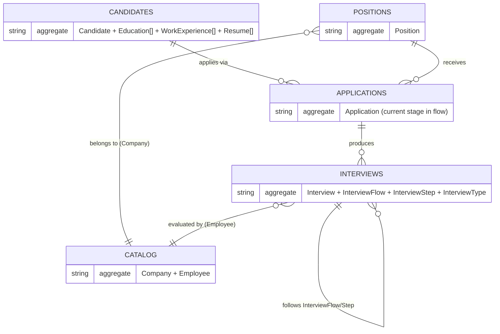
```mermaid
erDiagram
    CANDIDATES ||--o{ APPLICATIONS : "applies via"
    POSITIONS ||--o{ APPLICATIONS : "receives"
    APPLICATIONS ||--o{ INTERVIEWS : "produces"
    POSITIONS }o--|| CATALOG : "belongs to (Company)"
    INTERVIEWS }o--|| CATALOG : "evaluated by (Employee)"
    INTERVIEWS ||--o{ INTERVIEWS : "follows InterviewFlow/Step"

    CANDIDATES {
        string aggregate "Candidate + Education[] + WorkExperience[] + Resume[]"
    }
    POSITIONS {
        string aggregate "Position"
    }
    APPLICATIONS {
        string aggregate "Application (current stage in flow)"
    }
    INTERVIEWS {
        string aggregate "Interview + InterviewFlow + InterviewStep + InterviewType"
    }
    CATALOG {
        string aggregate "Company + Employee"
    }
```

**Reglas conceptuales:**

- Un `Candidate` puede tener **0..N** `Application`s (una por posición a la que aplica).
- Una `Position` pertenece a exactamente **una** `Company` y sigue exactamente **un** `InterviewFlow`.
- Una `Application` está en exactamente **un** `InterviewStep` en cada momento (campo `currentInterviewStep`).
- Cada `Interview` pertenece a **una** `Application` y la realiza **un** `Employee`.
- `InterviewFlow` se compone de **N** `InterviewStep`s ordenados por `orderIndex`. Cada `InterviewStep` referencia a un `InterviewType` (Technical, HR, etc.).

### 4.3 Logical model — global ERD

Versión canónica del modelo de datos. Esta es la referencia detallada; el ERD de §3.10 es una vista preliminar resumida.

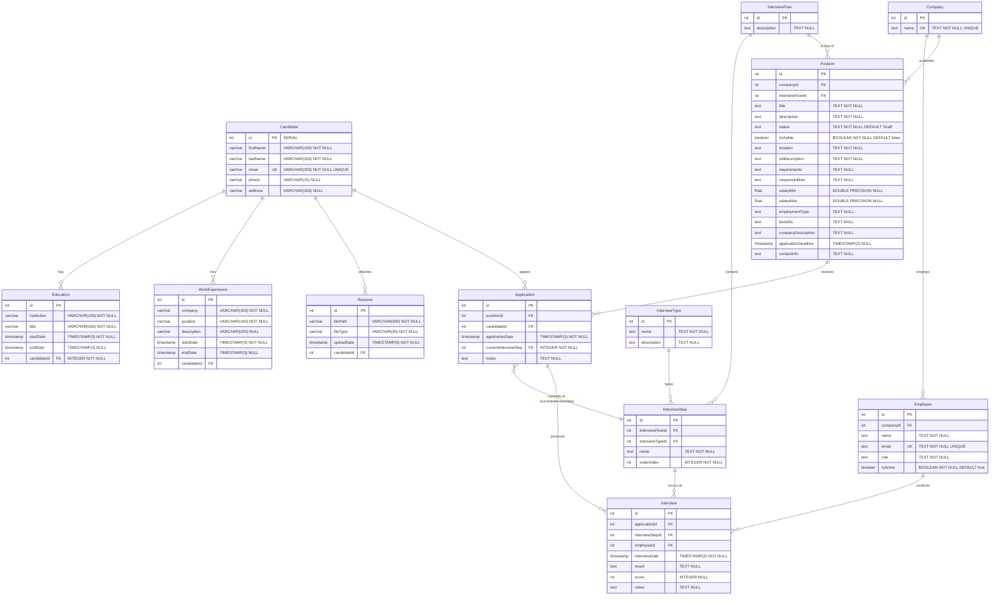
```mermaid
erDiagram
    Candidate ||--o{ Education : has
    Candidate ||--o{ WorkExperience : has
    Candidate ||--o{ Resume : attaches
    Candidate ||--o{ Application : applies

    Company ||--o{ Employee : employs
    Company ||--o{ Position : publishes

    InterviewFlow ||--o{ InterviewStep : contains
    InterviewFlow ||--o{ Position : "is flow of"
    InterviewType ||--o{ InterviewStep : types

    Position ||--o{ Application : receives
    Application }o--|| InterviewStep : "currently at (currentInterviewStep)"
    Application ||--o{ Interview : produces
    InterviewStep ||--o{ Interview : "occurs at"
    Employee ||--o{ Interview : conducts

    Candidate {
        int id PK "SERIAL"
        varchar firstName "VARCHAR(100) NOT NULL"
        varchar lastName "VARCHAR(100) NOT NULL"
        varchar email UK "VARCHAR(255) NOT NULL UNIQUE"
        varchar phone "VARCHAR(15) NULL"
        varchar address "VARCHAR(100) NULL"
    }
    Education {
        int id PK
        varchar institution "VARCHAR(100) NOT NULL"
        varchar title "VARCHAR(250) NOT NULL"
        timestamp startDate "TIMESTAMP(3) NOT NULL"
        timestamp endDate "TIMESTAMP(3) NULL"
        int candidateId FK "INTEGER NOT NULL"
    }
    WorkExperience {
        int id PK
        varchar company "VARCHAR(100) NOT NULL"
        varchar position "VARCHAR(100) NOT NULL"
        varchar description "VARCHAR(200) NULL"
        timestamp startDate "TIMESTAMP(3) NOT NULL"
        timestamp endDate "TIMESTAMP(3) NULL"
        int candidateId FK
    }
    Resume {
        int id PK
        varchar filePath "VARCHAR(500) NOT NULL"
        varchar fileType "VARCHAR(50) NOT NULL"
        timestamp uploadDate "TIMESTAMP(3) NOT NULL"
        int candidateId FK
    }
    Company {
        int id PK
        text name UK "TEXT NOT NULL UNIQUE"
    }
    Employee {
        int id PK
        int companyId FK
        text name "TEXT NOT NULL"
        text email UK "TEXT NOT NULL UNIQUE"
        text role "TEXT NOT NULL"
        boolean isActive "BOOLEAN NOT NULL DEFAULT true"
    }
    InterviewType {
        int id PK
        text name "TEXT NOT NULL"
        text description "TEXT NULL"
    }
    InterviewFlow {
        int id PK
        text description "TEXT NULL"
    }
    InterviewStep {
        int id PK
        int interviewFlowId FK
        int interviewTypeId FK
        text name "TEXT NOT NULL"
        int orderIndex "INTEGER NOT NULL"
    }
    Position {
        int id PK
        int companyId FK
        int interviewFlowId FK
        text title "TEXT NOT NULL"
        text description "TEXT NOT NULL"
        text status "TEXT NOT NULL DEFAULT 'Draft'"
        boolean isVisible "BOOLEAN NOT NULL DEFAULT false"
        text location "TEXT NOT NULL"
        text jobDescription "TEXT NOT NULL"
        text requirements "TEXT NULL"
        text responsibilities "TEXT NULL"
        float salaryMin "DOUBLE PRECISION NULL"
        float salaryMax "DOUBLE PRECISION NULL"
        text employmentType "TEXT NULL"
        text benefits "TEXT NULL"
        text companyDescription "TEXT NULL"
        timestamp applicationDeadline "TIMESTAMP(3) NULL"
        text contactInfo "TEXT NULL"
    }
    Application {
        int id PK
        int positionId FK
        int candidateId FK
        timestamp applicationDate "TIMESTAMP(3) NOT NULL"
        int currentInterviewStep FK "INTEGER NOT NULL"
        text notes "TEXT NULL"
    }
    Interview {
        int id PK
        int applicationId FK
        int interviewStepId FK
        int employeeId FK
        timestamp interviewDate "TIMESTAMP(3) NOT NULL"
        text result "TEXT NULL"
        int score "INTEGER NULL"
        text notes "TEXT NULL"
    }
```

### 4.4 Logical model per bounded context

Cinco vistas reducidas, una por bounded context (§3.5). Útiles para explicar el modelo a equipos enfocados en un módulo.

#### 4.4.1 Candidates context

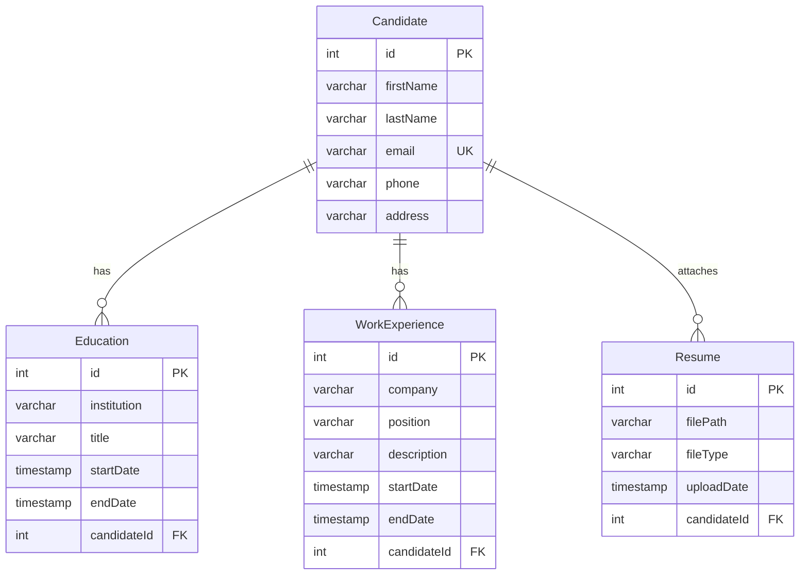
```mermaid
erDiagram
    Candidate ||--o{ Education : has
    Candidate ||--o{ WorkExperience : has
    Candidate ||--o{ Resume : attaches

    Candidate {
        int id PK
        varchar firstName
        varchar lastName
        varchar email UK
        varchar phone
        varchar address
    }
    Education {
        int id PK
        varchar institution
        varchar title
        timestamp startDate
        timestamp endDate
        int candidateId FK
    }
    WorkExperience {
        int id PK
        varchar company
        varchar position
        varchar description
        timestamp startDate
        timestamp endDate
        int candidateId FK
    }
    Resume {
        int id PK
        varchar filePath
        varchar fileType
        timestamp uploadDate
        int candidateId FK
    }
```

#### 4.4.2 Positions context

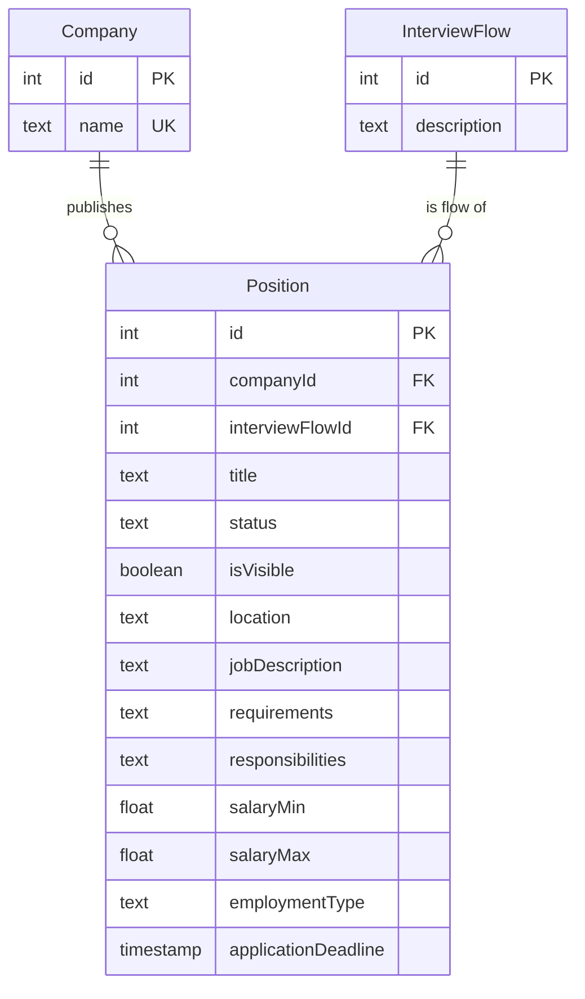
```mermaid
erDiagram
    Company ||--o{ Position : publishes
    InterviewFlow ||--o{ Position : "is flow of"

    Position {
        int id PK
        int companyId FK
        int interviewFlowId FK
        text title
        text status
        boolean isVisible
        text location
        text jobDescription
        text requirements
        text responsibilities
        float salaryMin
        float salaryMax
        text employmentType
        timestamp applicationDeadline
    }
    Company {
        int id PK
        text name UK
    }
    InterviewFlow {
        int id PK
        text description
    }
```

#### 4.4.3 Applications context (Kanban core)

```mermaid
erDiagram
    Candidate ||--o{ Application : applies
    Position ||--o{ Application : receives
    InterviewStep ||--o{ Application : "is current step of"

    Application {
        int id PK
        int positionId FK
        int candidateId FK
        timestamp applicationDate
        int currentInterviewStep FK
        text notes
    }
    Candidate {
        int id PK
        varchar firstName
        varchar lastName
        varchar email UK
    }
    Position {
        int id PK
        text title
        text status
    }
    InterviewStep {
        int id PK
        text name
        int orderIndex
    }
```

#### 4.4.4 Interviews context

```mermaid
erDiagram
    InterviewFlow ||--o{ InterviewStep : contains
    InterviewType ||--o{ InterviewStep : types
    Application ||--o{ Interview : produces
    InterviewStep ||--o{ Interview : "occurs at"
    Employee ||--o{ Interview : conducts

    InterviewFlow {
        int id PK
        text description
    }
    InterviewStep {
        int id PK
        int interviewFlowId FK
        int interviewTypeId FK
        text name
        int orderIndex
    }
    InterviewType {
        int id PK
        text name
        text description
    }
    Interview {
        int id PK
        int applicationId FK
        int interviewStepId FK
        int employeeId FK
        timestamp interviewDate
        text result
        int score
        text notes
    }
```

#### 4.4.5 Catalog context

```mermaid
erDiagram
    Company ||--o{ Employee : employs

    Company {
        int id PK
        text name UK
    }
    Employee {
        int id PK
        int companyId FK
        text name
        text email UK
        text role
        boolean isActive
    }
```

### 4.5 Data dictionary

Diccionario completo de las 12 entidades. Tipos verificados contra los `CREATE TABLE` reales en las migraciones SQL.

#### 4.5.1 `Candidate`

| Column | PostgreSQL Type | Nullable | Constraints | Description |
|--------|-----------------|----------|-------------|-------------|
| `id` | `SERIAL` (INTEGER) | NO | PK | Surrogate key |
| `firstName` | `VARCHAR(100)` | NO | — | Candidate first name |
| `lastName` | `VARCHAR(100)` | NO | — | Candidate last name |
| `email` | `VARCHAR(255)` | NO | UNIQUE (`Candidate_email_key`) | Business identifier; used for deduplication |
| `phone` | `VARCHAR(15)` | YES | — | Optional phone (no format validation at DB level) |
| `address` | `VARCHAR(100)` | YES | — | Free-text address |

#### 4.5.2 `Education`

| Column | PostgreSQL Type | Nullable | Constraints | Description |
|--------|-----------------|----------|-------------|-------------|
| `id` | `SERIAL` | NO | PK | Surrogate key |
| `institution` | `VARCHAR(100)` | NO | — | Educational institution name |
| `title` | `VARCHAR(250)` | NO | — | Degree / certificate title |
| `startDate` | `TIMESTAMP(3)` | NO | — | Start of the education period |
| `endDate` | `TIMESTAMP(3)` | YES | — | End date; NULL means ongoing |
| `candidateId` | `INTEGER` | NO | FK → `Candidate(id)` ON DELETE RESTRICT ON UPDATE CASCADE | Owner candidate |

#### 4.5.3 `WorkExperience`

| Column | PostgreSQL Type | Nullable | Constraints | Description |
|--------|-----------------|----------|-------------|-------------|
| `id` | `SERIAL` | NO | PK | Surrogate key |
| `company` | `VARCHAR(100)` | NO | — | Company name (free text, **not** linked to `Company` table) |
| `position` | `VARCHAR(100)` | NO | — | Job title at the company |
| `description` | `VARCHAR(200)` | YES | — | Free-text description of duties |
| `startDate` | `TIMESTAMP(3)` | NO | — | Period start |
| `endDate` | `TIMESTAMP(3)` | YES | — | Period end; NULL means current job |
| `candidateId` | `INTEGER` | NO | FK → `Candidate(id)` | Owner candidate |

> **Nota de modelado:** `WorkExperience.company` es texto libre, no referencia a la entidad `Company` del catálogo (que representa empresas-cliente, no historial laboral del candidato). Esto es **deliberado y correcto**: las empresas donde el candidato trabajó previamente no son las mismas que las clientes de la agencia.

#### 4.5.4 `Resume`

| Column | PostgreSQL Type | Nullable | Constraints | Description |
|--------|-----------------|----------|-------------|-------------|
| `id` | `SERIAL` | NO | PK | Surrogate key |
| `filePath` | `VARCHAR(500)` | NO | — | Internal path on the host's filesystem |
| `fileType` | `VARCHAR(50)` | NO | — | MIME type (e.g. `application/pdf`) |
| `uploadDate` | `TIMESTAMP(3)` | NO | — | When the file was uploaded |
| `candidateId` | `INTEGER` | NO | FK → `Candidate(id)` | Owner candidate |

> **Histórico:** un mismo candidato puede tener varios `Resume`. El "CV actual" es el más reciente por `uploadDate` (regla de aplicación, no de DB).

#### 4.5.5 `Company`

| Column | PostgreSQL Type | Nullable | Constraints | Description |
|--------|-----------------|----------|-------------|-------------|
| `id` | `SERIAL` | NO | PK | Surrogate key |
| `name` | `TEXT` | NO | UNIQUE (`Company_name_key`) | Client company name |

#### 4.5.6 `Employee`

| Column | PostgreSQL Type | Nullable | Constraints | Description |
|--------|-----------------|----------|-------------|-------------|
| `id` | `SERIAL` | NO | PK | Surrogate key |
| `companyId` | `INTEGER` | NO | FK → `Company(id)` | Employing company |
| `name` | `TEXT` | NO | — | Employee full name |
| `email` | `TEXT` | NO | UNIQUE (`Employee_email_key`) | Login / contact email |
| `role` | `TEXT` | NO | — | Free-text role (e.g. "Tech Lead", "HR") |
| `isActive` | `BOOLEAN` | NO | DEFAULT `true` | Soft-flag for assignability as interviewer |

#### 4.5.7 `InterviewType`

| Column | PostgreSQL Type | Nullable | Constraints | Description |
|--------|-----------------|----------|-------------|-------------|
| `id` | `SERIAL` | NO | PK | Surrogate key |
| `name` | `TEXT` | NO | — | Type name (e.g. "Technical", "HR Screening") |
| `description` | `TEXT` | YES | — | Optional description |

#### 4.5.8 `InterviewFlow`

| Column | PostgreSQL Type | Nullable | Constraints | Description |
|--------|-----------------|----------|-------------|-------------|
| `id` | `SERIAL` | NO | PK | Surrogate key |
| `description` | `TEXT` | YES | — | Free-text description of the flow |

> **Modelado:** `InterviewFlow` no tiene `name` propio; se identifica por `description`. Posible mejora: añadir `name TEXT NOT NULL UNIQUE` para referencias humanas.

#### 4.5.9 `InterviewStep`

| Column | PostgreSQL Type | Nullable | Constraints | Description |
|--------|-----------------|----------|-------------|-------------|
| `id` | `SERIAL` | NO | PK | Surrogate key |
| `interviewFlowId` | `INTEGER` | NO | FK → `InterviewFlow(id)` | Parent flow |
| `interviewTypeId` | `INTEGER` | NO | FK → `InterviewType(id)` | Type of this step |
| `name` | `TEXT` | NO | — | Step name (e.g. "Technical Interview", "Final Round") |
| `orderIndex` | `INTEGER` | NO | — | Position within the flow (used by Kanban column ordering) |

#### 4.5.10 `Position`

| Column | PostgreSQL Type | Nullable | Constraints | Description |
|--------|-----------------|----------|-------------|-------------|
| `id` | `SERIAL` | NO | PK | Surrogate key |
| `companyId` | `INTEGER` | NO | FK → `Company(id)` | Owning client company |
| `interviewFlowId` | `INTEGER` | NO | FK → `InterviewFlow(id)` | Hiring flow used |
| `title` | `TEXT` | NO | — | Position title (e.g. "Senior Backend Engineer") |
| `description` | `TEXT` | NO | — | Short description |
| `status` | `TEXT` | NO | DEFAULT `'Draft'` | Lifecycle: `Draft` / `Open` / `Closed` (no DB-level CHECK) |
| `isVisible` | `BOOLEAN` | NO | DEFAULT `false` | Whether shown in the public portal |
| `location` | `TEXT` | NO | — | Geographic location |
| `jobDescription` | `TEXT` | NO | — | Long job description |
| `requirements` | `TEXT` | YES | — | Required skills / experience |
| `responsibilities` | `TEXT` | YES | — | Day-to-day responsibilities |
| `salaryMin` | `DOUBLE PRECISION` | YES | — | Lower salary band |
| `salaryMax` | `DOUBLE PRECISION` | YES | — | Upper salary band |
| `employmentType` | `TEXT` | YES | — | Free text (e.g. "Full-time", "Contract") |
| `benefits` | `TEXT` | YES | — | Benefits description |
| `companyDescription` | `TEXT` | YES | — | Snapshot of the company description (denormalized) |
| `applicationDeadline` | `TIMESTAMP(3)` | YES | — | Optional deadline |
| `contactInfo` | `TEXT` | YES | — | Free-text contact channel |

> **Observación crítica:** `Position` mezcla 17 columnas con tres responsabilidades distintas: definición de la oferta (title/description/...), parámetros operativos (status/isVisible/deadline) y snapshot de empresa (companyDescription). Ver §4.9 (normalización) y §4.11 (roadmap).

#### 4.5.11 `Application`

| Column | PostgreSQL Type | Nullable | Constraints | Description |
|--------|-----------------|----------|-------------|-------------|
| `id` | `SERIAL` | NO | PK | Surrogate key |
| `positionId` | `INTEGER` | NO | FK → `Position(id)` | Position the candidate is applying to |
| `candidateId` | `INTEGER` | NO | FK → `Candidate(id)` | Applying candidate |
| `applicationDate` | `TIMESTAMP(3)` | NO | — | When the application was created |
| `currentInterviewStep` | `INTEGER` | NO | FK → `InterviewStep(id)` | Current Kanban column |
| `notes` | `TEXT` | YES | — | Recruiter notes |

> **Histórico:** una migración intermedia (`20240528110522`) añadió un campo `status TEXT NOT NULL` que fue **eliminado** en la siguiente (`20240528140846`). El estado de la aplicación se representa hoy únicamente por `currentInterviewStep`. La columna `status` no existe en el modelo actual.

> **Decisión D4 del PRD:** "No Asignado" se modela como un `InterviewStep` específico (con `name = "No Asignado"`), **no** como `currentInterviewStep` nulo. Esto es coherente con el FK NOT NULL.

#### 4.5.12 `Interview`

| Column | PostgreSQL Type | Nullable | Constraints | Description |
|--------|-----------------|----------|-------------|-------------|
| `id` | `SERIAL` | NO | PK | Surrogate key |
| `applicationId` | `INTEGER` | NO | FK → `Application(id)` | Owning application |
| `interviewStepId` | `INTEGER` | NO | FK → `InterviewStep(id)` | Step at which this interview took place |
| `employeeId` | `INTEGER` | NO | FK → `Employee(id)` | Interviewer |
| `interviewDate` | `TIMESTAMP(3)` | NO | — | Date the interview occurred |
| `result` | `TEXT` | YES | — | Free-text outcome label (Pass / Fail / NoShow / ...) |
| `score` | `INTEGER` | YES | — | Numeric score; range not constrained at DB level |
| `notes` | `TEXT` | YES | — | Free-text notes |

### 4.6 Relationships matrix

Resumen tabular de las claves foráneas y su comportamiento referencial. **Todas** las FKs se generaron por Prisma con `ON DELETE RESTRICT ON UPDATE CASCADE` (verificado en `20240528082702/migration.sql` y `20240528085016/migration.sql`).

| Child entity | Column | Parent entity | Cardinality | ON DELETE | ON UPDATE | Notes |
|--------------|--------|---------------|-------------|-----------|-----------|-------|
| `Education` | `candidateId` | `Candidate` | N : 1 | RESTRICT | CASCADE | Cannot delete a candidate with educations |
| `WorkExperience` | `candidateId` | `Candidate` | N : 1 | RESTRICT | CASCADE | Same as above |
| `Resume` | `candidateId` | `Candidate` | N : 1 | RESTRICT | CASCADE | Same as above |
| `Application` | `candidateId` | `Candidate` | N : 1 | RESTRICT | CASCADE | Cannot delete a candidate with applications |
| `Application` | `positionId` | `Position` | N : 1 | RESTRICT | CASCADE | Cannot delete a position with applications |
| `Application` | `currentInterviewStep` | `InterviewStep` | N : 1 | RESTRICT | CASCADE | Cannot delete a step that is in use as someone's current step |
| `Interview` | `applicationId` | `Application` | N : 1 | RESTRICT | CASCADE | Cannot delete an application with interviews |
| `Interview` | `interviewStepId` | `InterviewStep` | N : 1 | RESTRICT | CASCADE | Same as above for the step where the interview took place |
| `Interview` | `employeeId` | `Employee` | N : 1 | RESTRICT | CASCADE | Cannot delete an employee with conducted interviews |
| `Employee` | `companyId` | `Company` | N : 1 | RESTRICT | CASCADE | Cannot delete a company with employees |
| `Position` | `companyId` | `Company` | N : 1 | RESTRICT | CASCADE | Cannot delete a company with positions |
| `Position` | `interviewFlowId` | `InterviewFlow` | N : 1 | RESTRICT | CASCADE | Cannot delete a flow assigned to positions |
| `InterviewStep` | `interviewFlowId` | `InterviewFlow` | N : 1 | RESTRICT | CASCADE | Cannot delete a flow with steps |
| `InterviewStep` | `interviewTypeId` | `InterviewType` | N : 1 | RESTRICT | CASCADE | Cannot delete a type used by steps |

> **Implicación operativa:** la política `RESTRICT` total impide cualquier borrado físico mientras existan referencias. Para "borrar" un candidato, una posición o un empleado hace falta **soft delete** (gap §4.10) o un proceso ETL que elimine en cascada manualmente.

### 4.7 Indexes — current vs. recommended

#### 4.7.1 Current (as-is)

PostgreSQL crea automáticamente:
- Un índice **B-tree único** sobre cada `PRIMARY KEY` (`<table>_pkey`).
- Un índice **B-tree único** sobre cada columna marcada `@unique` en Prisma.

Índices únicos verificados en las migraciones:

| Index name | Table | Columns | Origin |
|------------|-------|---------|--------|
| `Candidate_pkey` | `Candidate` | `(id)` | PK |
| `Candidate_email_key` | `Candidate` | `(email)` | `@unique` |
| `Education_pkey` | `Education` | `(id)` | PK |
| `WorkExperience_pkey` | `WorkExperience` | `(id)` | PK |
| `Resume_pkey` | `Resume` | `(id)` | PK |
| `Company_pkey` | `Company` | `(id)` | PK |
| `Company_name_key` | `Company` | `(name)` | `@unique` |
| `Employee_pkey` | `Employee` | `(id)` | PK |
| `Employee_email_key` | `Employee` | `(email)` | `@unique` |
| `InterviewType_pkey` | `InterviewType` | `(id)` | PK |
| `InterviewFlow_pkey` | `InterviewFlow` | `(id)` | PK |
| `InterviewStep_pkey` | `InterviewStep` | `(id)` | PK |
| `Position_pkey` | `Position` | `(id)` | PK |
| `Application_pkey` | `Application` | `(id)` | PK |
| `Interview_pkey` | `Interview` | `(id)` | PK |

> **Gap crítico:** **no existe ningún índice sobre columnas FK**. PostgreSQL no auto-indexa FKs (a diferencia de MySQL/InnoDB). Esto degrada todas las consultas de tipo "hijos por padre" (la inmensa mayoría de las del sistema, incluido CU-04 `GET /positions/:id/candidates`).

#### 4.7.2 Recommended (not implemented)

| Index name | Table | Columns | Type | Justification | Priority |
|------------|-------|---------|------|---------------|----------|
| `Application_positionId_idx` | `Application` | `(positionId)` | B-tree | **CU-04** filtra por `positionId`; sin índice hace seq-scan completo | **Alta** |
| `Application_candidateId_idx` | `Application` | `(candidateId)` | B-tree | "Aplicaciones de un candidato" (vista perfil candidato) | Alta |
| `Application_currentInterviewStep_idx` | `Application` | `(currentInterviewStep)` | B-tree | Necesario para "candidatos en cierta fase" | Media |
| `Interview_applicationId_idx` | `Interview` | `(applicationId)` | B-tree | Cálculo de `avgScore` en CU-04 | **Alta** |
| `Interview_employeeId_idx` | `Interview` | `(employeeId)` | B-tree | "Entrevistas de un entrevistador" | Media |
| `Interview_interviewStepId_idx` | `Interview` | `(interviewStepId)` | B-tree | "Entrevistas en cierta fase" | Baja |
| `Position_companyId_idx` | `Position` | `(companyId)` | B-tree | "Posiciones de una empresa" | Media |
| `Position_interviewFlowId_idx` | `Position` | `(interviewFlowId)` | B-tree | Lookup operacional | Baja |
| `Position_isVisible_status_idx` | `Position` | `(isVisible, status)` | B-tree compuesto, parcial `WHERE isVisible = true` | Portal público listará posiciones con `isVisible = true` AND `status = 'Open'` | Media |
| `InterviewStep_interviewFlowId_orderIndex_idx` | `InterviewStep` | `(interviewFlowId, orderIndex)` | B-tree compuesto | Render del Kanban necesita los steps de un flow ordenados | **Alta** |
| `InterviewStep_interviewTypeId_idx` | `InterviewStep` | `(interviewTypeId)` | B-tree | Lookup operacional | Baja |
| `Employee_companyId_idx` | `Employee` | `(companyId)` | B-tree | "Empleados de una empresa" | Media |
| `Education_candidateId_idx` | `Education` | `(candidateId)` | B-tree | Carga de educations al ver candidato | Media |
| `WorkExperience_candidateId_idx` | `WorkExperience` | `(candidateId)` | B-tree | Carga de experiencias al ver candidato | Media |
| `Resume_candidateId_idx` | `Resume` | `(candidateId)` | B-tree | Lookup del CV actual | Media |

> **Restricción de unicidad recomendada (no implementada):** `UNIQUE(candidateId, positionId)` sobre `Application` para impedir que un candidato tenga dos `Application`s a la misma posición (regla a confirmar — D del PRD §2.7 sugiere esta unicidad).

### 4.8 Constraints, defaults & invariants

#### 4.8.1 Constraints presentes en DB (as-is)

- **Primary keys** sobre `id` en las 12 tablas.
- **NOT NULL** según data dictionary (§4.5).
- **UNIQUE** sobre `Candidate.email`, `Company.name`, `Employee.email`.
- **DEFAULT values:**
  - `Position.status` → `'Draft'`
  - `Position.isVisible` → `false`
  - `Employee.isActive` → `true`
- **FK referential integrity:** `RESTRICT` ON DELETE / `CASCADE` ON UPDATE en las 14 FKs (§4.6).

#### 4.8.2 Invariantes de dominio sin reflejar en DB (gaps)

Reglas de negocio que se mencionan en el PRD pero que **no están aplicadas** como CHECK constraints:

| Invariante | Donde se enuncia | Hoy | Recomendado |
|------------|------------------|-----|-------------|
| `Position.status` ∈ {`Draft`, `Open`, `Closed`} | §3.8.2, ADR-001 | `TEXT` libre | `CHECK (status IN ('Draft','Open','Closed'))` o tabla de catálogo |
| `Position.salaryMax >= salaryMin` cuando ambas existen | PRD §1.4 | Sin restricción | `CHECK (salaryMax IS NULL OR salaryMin IS NULL OR salaryMax >= salaryMin)` |
| `Education.endDate >= startDate` cuando endDate existe | CU-01 §2.3 edge case | Sin restricción | `CHECK (endDate IS NULL OR endDate >= startDate)` |
| `WorkExperience.endDate >= startDate` cuando endDate existe | Misma lógica | Sin restricción | Idem |
| `Interview.score` ∈ `[0, 5]` o `[0, 10]` | PRD §1.4 (score genérico) | `INTEGER NULL` libre (rango int4) | `CHECK (score IS NULL OR score BETWEEN 0 AND 5)` — **rango a confirmar con producto** |
| `Interview.result` ∈ valores cerrados | Inferido | `TEXT` libre | Convertir a enum o `CHECK` |
| `InterviewStep.orderIndex >= 0` y único dentro de un flow | §3.8.4 regla de Kanban | Sin restricción | `CHECK (orderIndex >= 0)` + `UNIQUE(interviewFlowId, orderIndex)` |
| `Application(currentInterviewStep)` debe pertenecer al `InterviewFlow` de su `Position` | Invariante crítica del Kanban (CU-05) | Sin restricción | No expresable como CHECK simple — requiere trigger o validación en aplicación (preferible) |
| `Application(candidateId, positionId)` único | D del PRD §2.7 | Sin restricción | `UNIQUE(candidateId, positionId)` |

### 4.9 Normalization analysis

El modelo está globalmente en **3NF** con dos infracciones específicas y una decisión deliberada que conviene documentar.

#### 4.9.1 Infracciones detectadas

**1. `Position.companyDescription` — denormalización injustificada**
- La descripción de la empresa **debería vivir** en `Company`, no replicarse en cada `Position`.
- Impacto: si `Company` cambia su descripción, las posiciones publicadas mantienen la versión antigua → drift silencioso.
- **Recomendación:** mover `companyDescription` a `Company.description TEXT NULL`. Si se quiere conservar el snapshot histórico (porque es deseable que la oferta refleje cómo era la empresa al publicarse), renombrar a `Position.companyDescriptionSnapshot` y dejar claro el propósito en comentario SQL.

**2. `Position` con responsabilidades mezcladas (no es 3NF estricta sino *cohesion smell*)**
- 17 columnas con tres grupos de cohesión: definición de oferta, parámetros operativos, snapshot de empresa.
- No es violación de 3NF formal (no hay dependencia transitiva problemática), pero rompe el principio de **responsabilidad única** del modelo.
- **Recomendación:** evaluar split en una migración futura:
  - `Position` (core): `id`, `companyId`, `interviewFlowId`, `title`, `description`, `status`, `isVisible`, `applicationDeadline`.
  - `PositionDetails` (1:1 opcional con Position): `location`, `jobDescription`, `requirements`, `responsibilities`, `salaryMin`, `salaryMax`, `employmentType`, `benefits`, `contactInfo`.
- **Coste/beneficio:** mejora la cohesión y permite cargar la lista de posiciones en Kanban sin traer todo el detalle. Coste: una migración + actualización de queries. **Decisión a confirmar con producto.**

#### 4.9.2 Decisiones deliberadas (no son violaciones)

- **`WorkExperience.company` como texto libre, no FK a `Company`.** Correcto: las empresas del historial laboral del candidato ≠ empresas-cliente de la agencia (§4.5.3). Mantener.
- **`Application.currentInterviewStep` como FK directa al step, no derivado.** Aunque sería derivable de la última `Interview` por timestamp, mantenerlo materializado simplifica enormemente el render del Kanban (CU-04). Es **denormalización controlada** y aceptable.

#### 4.9.3 Resumen de cumplimiento

| Forma normal | Estado | Notas |
|--------------|--------|-------|
| 1NF (atómicos, sin repetición) | ✅ | No hay arrays ni columnas repetidas |
| 2NF (no dependencia parcial de PK compuesta) | ✅ N/A | Todas las PKs son surrogadas |
| 3NF (no dependencia transitiva) | ⚠️ Casi | `Position.companyDescription` infringe levemente |
| BCNF | ⚠️ Casi | Misma infracción |

### 4.10 Identified gaps

Carencias del modelo actual con impacto operativo o de negocio. Marcadas con prioridad sugerida.

| ID | Gap | Impacto | Prioridad |
|----|-----|---------|-----------|
| G-01 | **Sin `createdAt` / `updatedAt`** en ninguna entidad | Sin trazabilidad temporal de altas/cambios; bloquea analítica y auditoría | Alta |
| G-02 | **Sin índices en columnas FK** (§4.7.1) | Degradación severa al crecer datos; CU-04 tendrá P95 inaceptable a partir de ~10k applications | **Crítica** |
| G-03 | **Sin tabla de transiciones de fase** (`StageTransition` o similar) | No hay log de quién movió un candidato, cuándo y de qué fase a qué fase. Bloquea auditoría y métricas de pipeline | Alta |
| G-04 | **Sin soft delete** | `RESTRICT` global hace imposible "archivar" una posición o un candidato sin borrar manualmente toda la cadena | Media |
| G-05 | **Sin `tenantId`** | El modelo asume single-tenant. Si producto pivota a multi-tenant, migración masiva (FK adicional en casi todas las tablas) | Media — depende de OQ1 |
| G-06 | **Sin CHECK constraints** sobre `status`, `score`, rangos de fechas, salarios (§4.8.2) | Datos corruptos posibles a nivel DB; toda la integridad descansa en la aplicación | Alta |
| G-07 | **`UNIQUE(candidateId, positionId)` ausente** en `Application` | Posible aplicación duplicada del mismo candidato a la misma posición | Alta |
| G-08 | **`UNIQUE(interviewFlowId, orderIndex)` ausente** en `InterviewStep` | Dos steps del mismo flow pueden compartir orden → render del Kanban inestable | Alta |
| G-09 | **Inconsistencia de tipos de cadena**: Candidates (VARCHAR(N)) vs. Catalog/Process (TEXT sin límite) | Degrada validación a nivel DB; potencial DoS de almacenamiento por inputs ilimitados | Media |
| G-10 | **Sin entidad `User`** (auth) | Bloqueante para producción; sin modelo de usuarios no hay autorización | **Crítica** (bloqueante) |
| G-11 | **`Position.companyDescription`** denormalizado (§4.9.1) | Posible drift entre snapshot y empresa actual | Baja |
| G-12 | **Score sin rango** (`INTEGER NULL` libre) | Datos inconsistentes posibles (negativos, valores fuera de la escala) | Media |
| G-13 | **`InterviewFlow` sin `name`** | Difícil identificar flows en UI / logs | Baja |
| G-14 | **`Position.status` y `result`/`Interview.result` como TEXT** | Sin enum ni FK a catálogo; valores libres → inconsistencia | Media |
| G-15 | **Sin metadata del CV** (`fileSize`, `originalFilename`, `checksum`) | Sin verificación de integridad ni vista humana del nombre original | Baja |

### 4.11 Migration roadmap (recomendado)

Cambios sugeridos agrupados en **migraciones aditivas no-rompedoras**, en el orden propuesto. Ninguna borra datos; las que añaden NOT NULL llevan default razonable o se aplican en dos pasos.

| Migración | Cambios | Aborda gaps | Riesgo | Sprint sugerido |
|-----------|---------|-------------|--------|-----------------|
| **M-01 — Indexes on FKs** | Añadir los 14 índices recomendados de §4.7.2 | G-02 | Bajo (`CREATE INDEX CONCURRENTLY`) | Inmediato (antes de F2) |
| **M-02 — Timestamps** | Añadir `createdAt TIMESTAMPTZ NOT NULL DEFAULT now()` y `updatedAt TIMESTAMPTZ NOT NULL DEFAULT now()` con trigger de actualización en las 12 tablas | G-01 | Bajo | Sprint 1 de F1 |
| **M-03 — Domain CHECK constraints** | CHECKs de §4.8.2 (status, score, salaries, date ranges) | G-06, G-12 | Medio (puede fallar si hay datos inválidos preexistentes — auditar antes) | Sprint 1 de F1 |
| **M-04 — Application uniqueness** | `UNIQUE(candidateId, positionId)` sobre `Application` | G-07 | Medio (auditar duplicados antes) | Junto con CU-04/CU-05 |
| **M-05 — Step ordering uniqueness** | `UNIQUE(interviewFlowId, orderIndex)` sobre `InterviewStep` | G-08 | Bajo | Junto con M-04 |
| **M-06 — StageTransition log table** | Nueva tabla `StageTransition(id, applicationId FK, fromStepId FK NULL, toStepId FK, movedById FK, movedAt)` | G-03 | Bajo (aditiva pura) | F2 — junto con CU-05 |
| **M-07 — Soft delete** | `deletedAt TIMESTAMPTZ NULL` en `Candidate`, `Position`, `Company`, `Employee`. Vistas `_active` correspondientes. Cambiar `RESTRICT` a `RESTRICT` o `SET NULL` según política | G-04 | Medio | F3 |
| **M-08 — Position split (opcional)** | Mover columnas de detalle a `PositionDetails` (1:1) | G-11, parcialmente §4.9.1 | Alto (refactor de queries) | Tras F3, si producto valida |
| **M-09 — Auth schema** | `User`, `Role`, `UserRole` (M:N), credenciales hasheadas, `RefreshToken` opcional | G-10 | Alto (cross-cutting) | F4 — change separado |
| **M-10 — Multi-tenant** (condicional) | Añadir `tenantId` a casi todas las tablas y backfill | G-05 | Muy alto | Solo si OQ1 lo confirma |
| **M-11 — Type uniformity** | Cambiar `TEXT` por `VARCHAR(N)` razonables en Catalog/Process | G-09 | Bajo | Cualquier momento |
| **M-12 — InterviewFlow name** | Añadir `InterviewFlow.name VARCHAR(100) NOT NULL UNIQUE` (con default temporal y backfill) | G-13 | Medio | Junto con F2 |
| **M-13 — Resume metadata** | `Resume.fileSize INTEGER`, `originalFilename TEXT`, `checksum VARCHAR(64)` | G-15 | Bajo | Cualquier momento |

> **Política recomendada:** todas las migraciones críticas (M-02, M-06, M-09) deben ir acompañadas de **tests de integridad referencial** y validación de datos preexistentes. No usar `prisma migrate deploy` directamente en producción sin staging previo.

### 4.12 Open questions (a confirmar con producto)

Decisiones que afectan al modelo y que no se pueden resolver sólo con el código y la documentación actual:

| OQ | Pregunta | Afecta a |
|----|----------|----------|
| OQ-DM-01 | ¿Rango exacto de `Interview.score`? PRD habla de "score" sin definir escala. Opciones típicas: `0–5`, `0–10`, `1–5`. | M-03 (CHECK) |
| OQ-DM-02 | ¿Multi-tenant o single-tenant? | M-10, ADR-006 §3.15 |
| OQ-DM-03 | ¿Se permite que un candidato tenga **varias `Application`s simultáneas a la misma posición** (re-aplicación tras descarte)? | M-04 (UNIQUE) |
| OQ-DM-04 | ¿`Position.companyDescription` debe ser **snapshot histórico** (mantener tras cambios en `Company`) o referenciar siempre el valor actual? | §4.9.1, M-08 |
| OQ-DM-05 | ¿Política de retención de CV? ¿Se borran cuando un candidato es archivado o se conservan N años por GDPR? | Política de M-07 |
| OQ-DM-06 | ¿Valores cerrados de `Interview.result`? | M-03 + posible tabla catálogo |
| OQ-DM-07 | ¿Fechas con timezone (`TIMESTAMPTZ`) o sin (`TIMESTAMP(3)` actual)? On-premise puede tener clientes en distintas zonas. | Toda migración futura con campos `*Date` |

---

### 4.13 Frequent queries (query catalog)

Catálogo de las consultas previsibles derivadas del PRD §1.4 y los casos de uso §2.3–§2.7. La frecuencia y criticidad determinan la estrategia de indexación (4.14) y caching (4.16).

| ID | Query | Origen | Frecuencia | Criticidad | Patrón SQL aproximado |
|----|-------|--------|------------|------------|------------------------|
| **Q-01** | Listar candidatos de una posición con fase actual y score medio | CU-04 (`GET /positions/:id/candidates`) — **núcleo del Kanban** | **Muy alta** (cada carga del tablero + cada drag&drop refresca) | **Crítica** | `SELECT a.id, c.firstName||' '||c.lastName, s.name, AVG(i.score) FROM Application a JOIN Candidate c ON c.id=a.candidateId JOIN InterviewStep s ON s.id=a.currentInterviewStep LEFT JOIN Interview i ON i.applicationId=a.id WHERE a.positionId=? GROUP BY a.id, c.id, s.id` |
| **Q-02** | Mover candidato entre fases | CU-05 (`PUT /candidates/:id/stage`) | Alta (write) | Crítica | `UPDATE Application SET currentInterviewStep=? WHERE id=?` precedido de validación de pertenencia al flow |
| **Q-03** | Ficha de candidato por id (con educations, workExperiences, applications) | CU-02 (`GET /candidates/:id`) — D6 del PRD recomienda incluir relaciones | Alta | Alta | `SELECT ... FROM Candidate c LEFT JOIN Education e ... LEFT JOIN WorkExperience w ... LEFT JOIN Application a ... WHERE c.id=?` (o N consultas separadas) |
| **Q-04** | Alta de candidato con anidados | CU-01 (`POST /candidates`) | Media (write) | Alta | `INSERT INTO Candidate ...; INSERT INTO Education ...; ... INSERT INTO Resume ...` en transacción |
| **Q-05** | Verificar email único antes de crear | CU-01 flow alterno A1 | Media | Alta | `SELECT 1 FROM Candidate WHERE email=?` |
| **Q-06** | Listar posiciones visibles (portal público) | PRD §1.4 customer journey candidato | Media-alta (público) | Alta | `SELECT ... FROM Position WHERE isVisible=true AND status='Open' ORDER BY applicationDeadline` |
| **Q-07** | Pipeline counts por columna del Kanban (cuántos candidatos en cada fase de una posición) | Métricas de la card del Kanban | **Muy alta** (mismo render que Q-01) | Alta | `SELECT s.id, s.name, s.orderIndex, COUNT(a.id) FROM InterviewStep s LEFT JOIN Application a ON a.currentInterviewStep=s.id AND a.positionId=? WHERE s.interviewFlowId=(SELECT interviewFlowId FROM Position WHERE id=?) GROUP BY s.id ORDER BY s.orderIndex` |
| **Q-08** | Steps ordenados de un flow (para pintar columnas) | Render Kanban | Muy alta (cacheable, cambia rara vez) | Alta | `SELECT * FROM InterviewStep WHERE interviewFlowId=? ORDER BY orderIndex` |
| **Q-09** | Posiciones de una empresa | Vista por cliente | Media | Media | `SELECT ... FROM Position WHERE companyId=?` |
| **Q-10** | Entrevistas próximas de un entrevistador (calendario) | PRD implícito (Employee tiene interviews) | Media | Media | `SELECT ... FROM Interview WHERE employeeId=? AND interviewDate >= NOW() ORDER BY interviewDate` |
| **Q-11** | Aplicaciones en una fase concreta (filtro Kanban "ver sólo Technical") | UX Kanban | Media | Media | `SELECT ... FROM Application WHERE positionId=? AND currentInterviewStep=?` |
| **Q-12** | Search por nombre/email del candidato | UX (no especificado pero esperable) | Media | Media | `SELECT ... FROM Candidate WHERE firstName ILIKE ?% OR lastName ILIKE ?% OR email ILIKE ?%` |
| **Q-13** | Tiempo en fase actual de cada Application (SLA breaches) | Métrica futura | Baja-media | Baja | Requiere `StageTransition` log (G-03 / M-06) |
| **Q-14** | Score medio histórico por entrevistador | Calidad de entrevistas | Baja | Baja | `SELECT employeeId, AVG(score) FROM Interview WHERE score IS NOT NULL GROUP BY employeeId` |
| **Q-15** | Aplicaciones de un candidato (todas las posiciones donde aplicó) | Vista perfil | Media | Media | `SELECT ... FROM Application WHERE candidateId=?` |

> **Top 3 críticas:** Q-01, Q-07, Q-08 — todas ocurren en cada render del Kanban. Optimizarlas es la prioridad de indexación (4.14). Q-08 es candidata clara a cache (4.16) porque `InterviewFlow`/`Step` cambian rara vez.

### 4.14 Index strategy — query-driven (extiende 4.7)

Esta subsección **completa** §4.7 mapeando cada índice recomendado a la query que lo justifica y añadiendo índices compuestos / parciales que no aparecían antes.

#### 4.14.1 Mapping query → index

| Query | Indexes que lo soportan | Tipo |
|-------|--------------------------|------|
| **Q-01** (Kanban listing) | `Application_positionId_idx`, `Interview_applicationId_idx`, `InterviewStep_pkey` | B-tree simple + B-tree compuesto |
| **Q-02** (Move stage) | `Application_pkey` (ya existe), `InterviewStep_pkey` para validar pertenencia al flow | PK |
| **Q-03** (Candidate profile) | `Candidate_pkey` + `Education_candidateId_idx` + `WorkExperience_candidateId_idx` + `Resume_candidateId_idx` + `Application_candidateId_idx` | PK + B-tree simples |
| **Q-04** (Insert) | `Candidate_email_key` (UNIQUE) — usado durante INSERT para detectar duplicados | UNIQUE |
| **Q-05** (Email lookup) | `Candidate_email_key` | UNIQUE — perfecto |
| **Q-06** (Public portal positions) | **`Position_visible_open_idx`** B-tree parcial sobre `(applicationDeadline)` con `WHERE isVisible=true AND status='Open'` | **B-tree parcial** |
| **Q-07** (Kanban column counts) | `InterviewStep_interviewFlowId_orderIndex_idx` + `Application_positionId_currentStep_idx` | B-tree compuestos |
| **Q-08** (Steps of flow) | `InterviewStep_interviewFlowId_orderIndex_idx` | B-tree compuesto |
| **Q-09** (Positions of company) | `Position_companyId_idx` | B-tree simple |
| **Q-10** (Interviewer agenda) | **`Interview_employeeId_interviewDate_idx`** B-tree compuesto | B-tree compuesto |
| **Q-11** (Apps in stage of position) | **`Application_position_step_idx`** = `Application(positionId, currentInterviewStep)` | B-tree compuesto |
| **Q-12** (Candidate search) | **`Candidate_search_trgm_idx`** = `GIN` sobre `(firstName, lastName, email)` con `pg_trgm` | **GIN trigram** |
| **Q-15** (Apps of candidate) | `Application_candidateId_idx` | B-tree simple |

#### 4.14.2 Índices que añade esta subsección a la lista de 4.7.2

| Index name | Table | Definition | Type | Justifica |
|------------|-------|------------|------|-----------|
| `Position_visible_open_idx` | `Position` | `(applicationDeadline) WHERE isVisible=true AND status='Open'` | B-tree **parcial** | Q-06 — portal público; reduce el índice a sólo posiciones abiertas y visibles |
| `Application_position_step_idx` | `Application` | `(positionId, currentInterviewStep)` | B-tree compuesto | Q-07, Q-11 — accesos del Kanban combinando ambos filtros |
| `Interview_employeeId_interviewDate_idx` | `Interview` | `(employeeId, interviewDate DESC)` | B-tree compuesto | Q-10 — calendario del entrevistador |
| `Candidate_search_trgm_idx` | `Candidate` | `GIN ((firstName \|\| ' ' \|\| lastName \|\| ' ' \|\| email)) USING gin_trgm_ops` | **GIN trigram** | Q-12 — search difuso por nombre/apellido/email. Requiere extensión `pg_trgm` |

> **Tip de mantenimiento:** monitorizar `pg_stat_user_indexes.idx_scan` periódicamente; si un índice no se usa tras 3 meses, eliminarlo. Cada índice penaliza writes (~5–10% por índice por tabla).

#### 4.14.3 Anti-patrones a evitar

- **Crear índices sin EXPLAIN:** verificar primero con `EXPLAIN (ANALYZE, BUFFERS)` que la query realmente lo usa.
- **Indexar columnas con baja cardinalidad** (e.g. `Position.isVisible`) sin combinarlas. Un índice parcial es mejor.
- **Usar `LIKE '%algo%'`** (full wildcard) sin GIN trigram — fuerza seq scan.
- **Indexar columnas TEXT muy grandes** sin truncar — afecta tamaño y rendimiento.

### 4.15 Partitioning analysis

Análisis de necesidad de particionamiento de tablas. Conclusión adelantada: **no se requiere particionado en V1 ni en el horizonte previsible.**

#### 4.15.1 Volumetría esperada (estimación basada en PRD §1.4)

Asumiendo el segmento objetivo (agencias de 5–50 reclutadores, según PRD §1.3):

| Tabla | Volumen estimado a 3 años | Comentario |
|-------|----------------------------|------------|
| `Candidate` | 20k–200k | Pool acumulado por agencia. Crece linealmente |
| `Application` | 50k–500k | ~2.5x candidatos (cada candidato aplica a varias) |
| `Interview` | 100k–1M | ~2x applications × 1–3 entrevistas |
| `Position` | 500–5k | Posiciones abiertas y cerradas acumuladas |
| `Resume` | 25k–250k | ~1.2x candidatos (algunos suben CV actualizado) |
| `Education`, `WorkExperience` | 60k–600k cada una | ~3x candidatos |
| Resto | < 1k | Catálogo, flows, types — volumen mínimo |

**PostgreSQL maneja sin problemas tablas de hasta 100M filas con índices adecuados.** Las cifras esperadas están **2 órdenes de magnitud por debajo** del umbral donde particionar empieza a tener sentido.

#### 4.15.2 Criterios para reconsiderar particionado

Particionar **no antes** de que se cumpla al menos uno:

| Trigger | Tabla candidata | Estrategia recomendada |
|---------|------------------|------------------------|
| `Interview` supera 50M filas | `Interview` | Range partitioning por `interviewDate` (year/month) |
| `Application` supera 10M filas | `Application` | Range por `applicationDate` o list por `positionId` si concentración fuerte |
| Queries históricas (analytics) afectan rendimiento operativo | Cualquier tabla `*Date` | Particionado declarativo + retención de particiones antiguas en tablespace lento |
| Multi-tenancy adoptada (G-05) con > 100 tenants y volumetría alta | Todas | List partitioning por `tenantId` |

#### 4.15.3 Si llega el momento

Postgres ofrece particionado declarativo desde la v10 (`PARTITION BY RANGE (interviewDate)`). Se puede migrar una tabla existente en caliente con `pg_partman` o equivalente, pero requiere downtime breve para el switch de tabla. **Diseñar las queries y los índices desde ya considerando que `interviewDate` y `applicationDate` puedan ser pivots futuros** — por eso el índice `Interview_employeeId_interviewDate_idx` usa `interviewDate` también como segunda columna del compuesto.

#### 4.15.4 Lo que **no** hay que particionar

- Tablas de catálogo (`Company`, `InterviewType`, `InterviewFlow`, `InterviewStep`) — su tamaño es trivial y no se beneficiarían.
- `Candidate` por `id` — la PK ya distribuye bien y los índices secundarios cubren los accesos.

### 4.16 Caching strategy

Tres niveles de cache, ordenados por blast radius creciente. **Recomendación general: empezar sin cache distribuida; sumarla sólo cuando el profiling lo justifique.**

#### 4.16.1 Niveles de cache

| Nivel | Tecnología | Qué cachea | TTL | Invalida cuando | Estado actual |
|-------|------------|------------|-----|-----------------|---------------|
| **L0 — Plan cache de PostgreSQL** | Built-in | Planes de ejecución de prepared statements | Vida del statement | Automático tras `ANALYZE` | Activo (Prisma usa prepared statements) |
| **L1 — App in-memory cache (Node)** | `node-cache` o `lru-cache` (sin dependencia externa) | `InterviewFlow` + `InterviewStep`s por flow (Q-08); `Position` (Q-09 reads) | 5–15 min | Mutación admin de flows / posiciones | **No implementado** — añadir en F2 |
| **L2 — HTTP cache (response cache)** | Cabeceras `Cache-Control` + `ETag` | Listado de posiciones públicas (Q-06), ficha de posición pública | 60 s `public, max-age=60` | Cambio de `status` o `isVisible` → bump de versión / purge | **No implementado** — añadir junto al portal público |
| **L3 — Cache distribuida** | Redis | Sesiones (cuando exista auth), rate-limit counters, locks | Variable | — | **No implementado, no recomendado todavía** |

#### 4.16.2 Qué cachear — y qué NO

**Cachear:**
- ✅ `InterviewFlow` + `InterviewStep`s (Q-08): cambian raramente, se piden en cada render del Kanban → **gran ROI**.
- ✅ `Position` por id si se accede mucho desde frontend (vista pública).
- ✅ `Company` listing (catálogo casi inmutable).
- ✅ Resultados de queries pesadas estables: e.g. `AVG(score) por employee` (Q-14) si se muestra en dashboard.

**NO cachear:**
- ❌ El listado del Kanban (Q-01): cambia con cada drag&drop. Cachearlo causaría inconsistencias visibles inmediatamente.
- ❌ Counts del Kanban (Q-07): mismo motivo.
- ❌ Ficha de candidato si se permite edición concurrente.
- ❌ Cualquier read tras un write hasta que se invalide la entrada (preferir `cache-aside` con invalidación explícita).

#### 4.16.3 Patrón recomendado por nivel

- **L1 (app):** *cache-aside* — el use case pregunta a la cache; en miss, consulta repo y guarda. La invalidación es **explícita** desde el use case que muta (`DefineInterviewFlow`, `UpdatePosition`).
- **L2 (HTTP):** *time-based* + ETag para revalidación condicional (`If-None-Match`). El cliente recibe `304 Not Modified` si no cambió.
- **L3 (Redis):** *write-through* sólo cuando la sesión sea durable o haya rate limiting compartido entre instancias. Hoy el sistema corre en single-instance — no aporta.

#### 4.16.4 Métricas de éxito del caching

Antes de declararlo "exitoso" hay que medir:

| Métrica | Objetivo |
|---------|----------|
| Hit rate L1 sobre Q-08 | > 90% |
| Reducción de latencia P95 de Q-08 | de ~20 ms → ~1 ms |
| Memoria L1 ocupada | < 100 MB por instancia |
| Stale-reads detectados (incoherencia post-mutación) | 0 |

#### 4.16.5 Cuándo introducir Redis

Sólo cuando se cumpla uno:

- Despliegue **multi-instancia** del API (load balancer + N réplicas).
- Necesidad de **rate limiting global** (no por instancia).
- Sesiones de usuario que deban sobrevivir a reinicios del API.
- Cache que crece más allá de la heap razonable de Node (> 500 MB).

> **Resumen ejecutivo de la sección 4:** el modelo actual cubre las 12 entidades necesarias para el dominio del ATS y está globalmente en 3NF, pero presenta **15 gaps** documentados con prioridad — el más crítico es la ausencia de índices sobre FKs (G-02), que será un cuello de botella en cuanto se implemente CU-04. La hoja de ruta de migraciones M-01…M-13 organiza los cambios en orden de menor a mayor riesgo, permitiendo cerrar G-02, G-01 y G-06 antes incluso de la fase F1 del plan de arquitectura. El catálogo de **15 queries frecuentes (§4.13)** se traduce en una estrategia de indexación **query-driven (§4.14)** con cuatro índices nuevos (compuestos, parciales y GIN trigram para búsqueda difusa). El **particionado no se necesita en V1** y los volúmenes proyectados están dos órdenes de magnitud por debajo del umbral. La **estrategia de caching (§4.16)** es escalonada: L0 plan cache (gratis), L1 in-memory para `InterviewFlow`/`InterviewStep` (alto ROI), L2 HTTP cache para portal público, y Redis sólo cuando haya multi-instancia.

---

## 5. Especificación de la API

> **Source of truth:** la especificación OpenAPI 3.0 completa vive en [`docs/openapi.yaml`](openapi.yaml) (per ADR-008 §3.15). Esta sección documenta el contrato a nivel humano: catálogo, esquemas comunes, contratos por endpoint con validaciones y diagramas de secuencia. **Cualquier divergencia entre esta sección y `docs/openapi.yaml` se resuelve a favor del YAML.**

### 5.1 Approach & conventions

- **Estilo:** REST sobre HTTP/JSON. Sin GraphQL ni gRPC en V1.
- **Versionado:** `info.version` en el YAML; sin prefijo de versión en URL todavía (la SPA y la API se despliegan juntas en on-premise — versionar URL será necesario el día que existan clientes externos).
- **Base URL local:** `http://localhost:3010` (el frontend en `:3000` con CORS abierto a ese origen).
- **Fechas:** `format: date` (YYYY-MM-DD) para fechas civiles; `format: date-time` (ISO 8601) para timestamps con hora.
- **Identificadores:** todos los `id` son enteros positivos (`SERIAL` en PostgreSQL).
- **Charset:** UTF-8 end-to-end.
- **Auth:** **no incluida en V1** (gap §3.14 / ADR-004). `security: []` global. Cuando se introduzca (F4 del plan), se añadirá `securitySchemes.bearerAuth` y `security: [{ bearerAuth: [] }]`.
- **Formato de error uniforme:**
  ```json
  { "error": "Mensaje descriptivo", "details": { "...campo": "...regla" } }
  ```
- **Códigos de estado canónicos:**
  - `200 OK` — lectura/escritura idempotente exitosa.
  - `201 Created` — recurso creado (devuelve el recurso completo).
  - `400 Bad Request` — payload o parámetros inválidos (incluye validation errors).
  - `404 Not Found` — recurso o ruta inexistente.
  - `409 Conflict` — *no usado en V1*; reservado para violaciones de unicidad reportadas explícitamente (hoy llegan como 400).
  - `413 Payload Too Large` — sólo en `POST /upload` cuando se exceda el límite de fichero.
  - `500 Internal Server Error` — error no controlado.

### 5.2 API surface

#### 5.2.1 Catálogo (V1)

| # | Method | Path | CU | Implementado | Tag |
|---|--------|------|----|--------------|-----|
| 1 | `POST` | `/candidates` | CU-01 | ✅ | Candidates |
| 2 | `GET` | `/candidates/{id}` | CU-02 | ✅ | Candidates |
| 3 | `POST` | `/upload` | CU-03 | ✅ | Files |
| 4 | `GET` | `/positions/{id}/candidates` | CU-04 | ❌ | Positions |
| 5 | `PUT` | `/candidates/{id}/stage` | CU-05 | ❌ | Candidates |

#### 5.2.2 Mapa de recursos

```mermaid
flowchart LR
    Client(["Client (SPA / Postman)"])

    subgraph API["API · http://localhost:3010"]
        direction TB
        subgraph CandidatesGroup["Candidates"]
            E1["POST /candidates"]
            E2["GET /candidates/{id}"]
            E5["PUT /candidates/{id}/stage"]
        end
        subgraph FilesGroup["Files"]
            E3["POST /upload"]
        end
        subgraph PositionsGroup["Positions"]
            E4["GET /positions/{id}/candidates"]
        end
    end

    DB[(PostgreSQL)]
    FS[(Filesystem<br/>uploads/)]

    Client -- "JSON" --> E1
    Client -- "JSON" --> E2
    Client -- "JSON" --> E5
    Client -- "multipart" --> E3
    Client -- "JSON" --> E4

    E1 --> DB
    E1 -. "filePath ref" .-> E3
    E2 --> DB
    E3 --> FS
    E4 --> DB
    E5 --> DB
```

### 5.3 Common schemas (resumen)

Los esquemas completos con tipos y constraints viven en [`docs/openapi.yaml`](openapi.yaml). Resumen aquí:

| Schema | Uso | Campos clave |
|--------|-----|--------------|
| `CandidateInput` | Body de `POST /candidates` | `firstName`, `lastName`, `email` (req); `phone`, `address`, `educations[]`, `workExperiences[]`, `cv` (opt) |
| `Candidate` | Response de `POST /candidates` y `GET /candidates/{id}` | Mismo + `id`, `resumes[]` |
| `EducationInput` / `Education` | Anidado en CandidateInput / Candidate | `institution`, `title`, `startDate`, `endDate` |
| `WorkExperienceInput` / `WorkExperience` | Anidado | `company`, `position`, `startDate`, `endDate`, `description` |
| `ResumeInput` / `Resume` | Anidado | `filePath`, `fileType` (`application/pdf`) |
| `UploadResponse` | Response de `POST /upload` | `filePath`, `fileType`, `originalName`, `size` |
| `PositionCandidate` | Response de `GET /positions/{id}/candidates` | `candidateId`, `fullName`, `currentInterviewStep`, `averageScore` (nullable) |
| `StageUpdateInput` | Body de `PUT /candidates/{id}/stage` | `applicationId`, `newInterviewStepId` |
| `StageUpdateResponse` | Response | `applicationId`, `currentInterviewStep` |
| `Error` | Cualquier 4xx/5xx | `error`, `details?` |

### 5.4 Validation rules (cross-cutting)

Reglas server-side aplicables a las inputs. Verificadas contra el `validator.ts` actual + complementadas con las del PRD.

| Campo | Regla | Origen |
|-------|-------|--------|
| `email` | Formato RFC 5322; máx. 255 chars; **único** en `Candidate` | DB UNIQUE + validator |
| `phone` | Opcional; máx. 15 chars; pattern `^[+0-9 ()-]{6,15}$` | validator |
| `firstName`, `lastName` | 1..100 chars; UTF-8 | DB VARCHAR(100) NOT NULL |
| `Education.endDate` | Si presente, `>= startDate` | PRD §2.3 edge case |
| `WorkExperience.endDate` | Si presente, `>= startDate` | PRD §2.3 edge case |
| `cv.fileType` | Solo `application/pdf` | CU-03 acceptance |
| Path `id` | Entero positivo (`>= 1`); `400` si no es numérico | CU-02/CU-04/CU-05 |
| `applicationId`, `newInterviewStepId` | Enteros positivos | CU-05 |
| `newInterviewStepId` pertenencia | Server-side: el step destino debe existir y pertenecer al `InterviewFlow` de la `Position` de la `Application`. `400` si no | CU-05 acceptance |

### 5.5 Per-endpoint contracts

#### 5.5.1 `POST /candidates` — Create candidate (CU-01)

| | |
|---|---|
| **Request body** | `CandidateInput` (JSON) |
| **Response 201** | `Candidate` (incluye `id` y entidades anidadas con sus ids) |
| **400** | Email inválido, email duplicado, `endDate < startDate`, formato inválido en cualquier campo |
| **500** | Error interno |

```mermaid
sequenceDiagram
    participant C as Client
    participant R as Express POST /candidates
    participant S as candidateService
    participant V as validator
    participant DB as PostgreSQL

    C->>R: JSON body
    R->>S: addCandidate(data)
    S->>V: validateCandidateData(data)
    V-->>S: OK / Error
    alt valid
        S->>DB: INSERT Candidate
        DB-->>S: candidate {id}
        loop educations / workExperiences / cv
            S->>DB: INSERT (with candidateId)
        end
        S-->>R: candidate aggregate
        R-->>C: 201 Created
    else invalid
        S-->>R: ValidationError
        R-->>C: 400 Bad Request
    end
```

#### 5.5.2 `GET /candidates/{id}` — Get candidate (CU-02)

| | |
|---|---|
| **Path param** | `id` integer ≥ 1 |
| **Response 200** | `Candidate` |
| **400** | `id` no numérico |
| **404** | Candidato no encontrado |
| **500** | Error interno |

```mermaid
sequenceDiagram
    participant C as Client
    participant R as Express GET /candidates/{id}
    participant CT as candidateController
    participant S as candidateService
    participant DB as PostgreSQL

    C->>R: GET /candidates/7
    R->>CT: getCandidateById
    CT->>CT: parseInt(id)
    alt id no numérico
        CT-->>C: 400 Invalid ID format
    else
        CT->>S: findCandidateById(7)
        S->>DB: SELECT Candidate WHERE id=7
        DB-->>S: candidate | null
        alt no encontrado
            S-->>CT: null
            CT-->>C: 404 Candidate not found
        else
            S-->>CT: candidate
            CT-->>C: 200 OK
        end
    end
```

#### 5.5.3 `POST /upload` — Upload CV (CU-03)

| | |
|---|---|
| **Request** | `multipart/form-data` con campo `file` (PDF, ≤ 10 MB) |
| **Response 200** | `UploadResponse` con `filePath`, `fileType`, `originalName`, `size` |
| **400** | Falta el campo `file`, tipo no PDF |
| **413** | Fichero excede límite |
| **500** | Error interno |

```mermaid
sequenceDiagram
    participant C as Client
    participant R as Express POST /upload
    participant M as multer
    participant S as fileUploadService
    participant FS as Filesystem

    C->>R: multipart (file=cv.pdf)
    R->>M: parse multipart
    M->>S: handleUpload(file)
    alt tipo != application/pdf
        S-->>R: error
        R-->>C: 400 Invalid file type
    else tipo válido
        S->>FS: write(uniquePath, buffer)
        FS-->>S: ok
        S-->>R: { filePath, fileType, originalName, size }
        R-->>C: 200 OK
    end
```

#### 5.5.4 `GET /positions/{id}/candidates` — Kanban listing (CU-04)

| | |
|---|---|
| **Path param** | `id` integer ≥ 1 (positionId) |
| **Response 200** | Array de `PositionCandidate` (puede ser vacío) |
| **400** | `id` no numérico |
| **404** | Position no existe (decisión D1 §2.8: 404 en lugar de 200 []) |
| **500** | Error interno |

```mermaid
sequenceDiagram
    participant C as Client
    participant R as Express GET /positions/{id}/candidates
    participant CT as positionController
    participant S as positionService
    participant DB as PostgreSQL

    C->>R: GET /positions/42/candidates
    R->>CT: listCandidatesByPosition
    CT->>S: getCandidatesByPosition(42)
    S->>DB: SELECT a JOIN Candidate JOIN InterviewStep LEFT JOIN Interview WHERE positionId=42
    DB-->>S: applications[]
    alt position no existe
        S-->>CT: NotFound
        CT-->>C: 404 Position not found
    else
        S->>S: avg(interviews.score) por application
        S-->>CT: PositionCandidate[]
        CT-->>C: 200 OK [{candidateId, fullName, currentInterviewStep, averageScore}]
    end
```

> **Nota de rendimiento:** una sola query con `JOIN`+`LEFT JOIN` y agregación es preferible a N+1 (un SELECT por candidato). Ver §4.7.2 — los índices `Application_positionId_idx` e `Interview_applicationId_idx` son **prerrequisito** para que P95 < 300 ms.

#### 5.5.5 `PUT /candidates/{id}/stage` — Move stage (CU-05)

| | |
|---|---|
| **Path param** | `id` integer ≥ 1 (candidateId) |
| **Request body** | `StageUpdateInput` con `applicationId` y `newInterviewStepId` |
| **Response 200** | `StageUpdateResponse` con `applicationId` y `currentInterviewStep` (idempotente si no cambia) |
| **400** | `id` no numérico, body inválido, **step destino no pertenece al flow de la posición** |
| **404** | Application no existe o no pertenece al candidato |
| **500** | Error interno |

```mermaid
sequenceDiagram
    participant C as Client
    participant R as Express PUT /candidates/{id}/stage
    participant CT as candidateController
    participant S as applicationService
    participant DB as PostgreSQL

    C->>R: PUT /candidates/7/stage { applicationId, newInterviewStepId }
    R->>CT: updateStage
    CT->>CT: parseInt(id), validar body
    alt entrada inválida
        CT-->>C: 400
    else
        CT->>S: moveStage(7, applicationId, newStepId)
        S->>DB: SELECT Application + Position.InterviewFlow.Steps
        DB-->>S: application
        alt application.candidateId != 7 o no existe
            S-->>CT: NotFound
            CT-->>C: 404
        else step destino fuera del flow
            S-->>CT: InvalidStep
            CT-->>C: 400 Invalid step for this position
        else válido
            S->>DB: UPDATE Application SET currentInterviewStep=newStepId
            DB-->>S: ok
            S-->>CT: { applicationId, currentInterviewStep }
            CT-->>C: 200 OK
        end
    end
```

### 5.6 Endpoints futuros (no especificados en V1)

Los bounded contexts de §3.5 implican endpoints adicionales que **no están en `docs/openapi.yaml`** porque su diseño detallado depende de decisiones de producto pendientes. Lista mínima:

| Bounded context | Endpoints previstos | Estado |
|------------------|----------------------|--------|
| Positions | `POST /positions`, `GET /positions`, `GET /positions/{id}`, `PATCH /positions/{id}`, `GET /positions/public` | Por especificar |
| Catalog | `POST /companies`, `GET /companies`, `POST /companies/{id}/employees`, `GET /employees` | Por especificar |
| Interviews | `POST /applications/{id}/interviews`, `GET /interview-flows`, `POST /interview-flows`, `POST /interview-flows/{id}/steps` | Por especificar |
| Applications | `POST /applications` (alta directa fuera del POST /candidates) | Por especificar |
| Auth | `POST /auth/login`, `POST /auth/refresh`, `GET /auth/me` | F4 del plan §3.11 |

Cuando se aborde cualquiera de estos endpoints, debe extenderse `docs/openapi.yaml` **antes** de implementar (spec-first per ADR-008).

### 5.7 Open questions (a confirmar con producto)

| OQ | Pregunta | Default propuesto |
|----|----------|-------------------|
| OQ-API-01 | `409 Conflict` para email duplicado en `POST /candidates` o seguir con `400`? | Mantener `400` con `error: "The email already exists in the database"` (compat con código actual) |
| OQ-API-02 | ¿Paginación en `GET /positions/{id}/candidates`? | No en V1; `?page` y `?pageSize` opcionales en V2 |
| OQ-API-03 | ¿`GET /candidates/{id}` debe traer relaciones (educations, workExperiences, applications) en el mismo response (D6 §2.8) o requerir endpoints separados? | Incluir en el mismo response — un Candidate completo |
| OQ-API-04 | ¿Tamaño máximo del PDF en `POST /upload`? | 10 MB (industria estándar para CV) |
| OQ-API-05 | ¿Rate limiting? | Sin rate limiting en V1; introducir junto con auth (F4) |
| OQ-API-06 | ¿`PATCH /candidates/{id}` para edición parcial? | No en V1; añadir cuando producto lo solicite |

---

> **Resumen ejecutivo de la sección 5:** la API V1 expone **5 endpoints** (3 implementados, 2 pendientes — los del Kanban) documentados spec-first en [`docs/openapi.yaml`](openapi.yaml). Sin auth (gap §3.14), CORS abierto a localhost en dev, formato de error uniforme (`{ error, details }`), códigos de estado canónicos. Los esquemas de request/response están alineados con los tipos del data model (§4.5) y las decisiones del PRD (§2.8). Los endpoints adicionales para Positions, Catalog e Interviews quedan como roadmap (§5.6) y deben pasar por la spec antes de implementarse.
